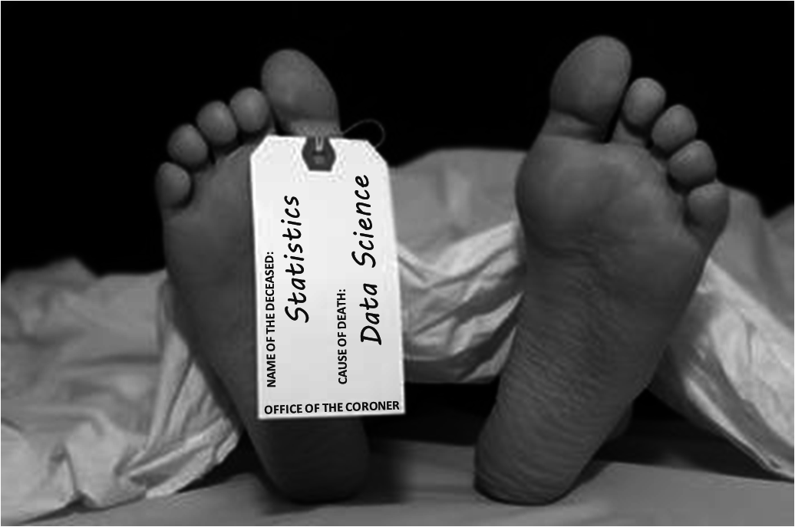
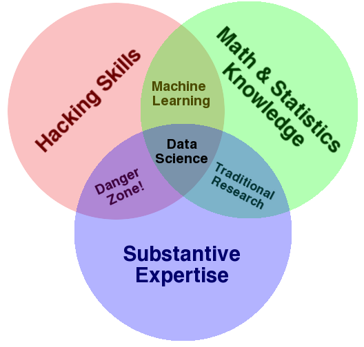
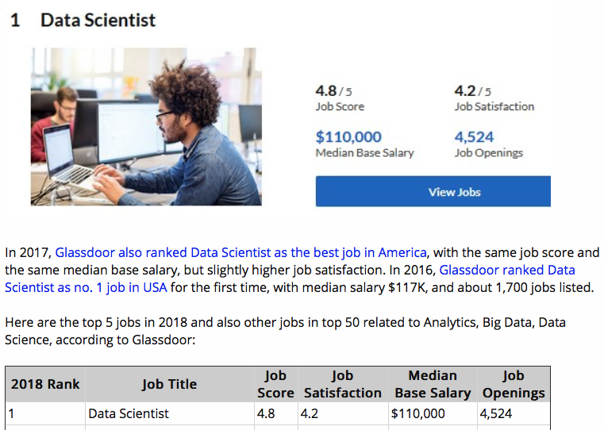
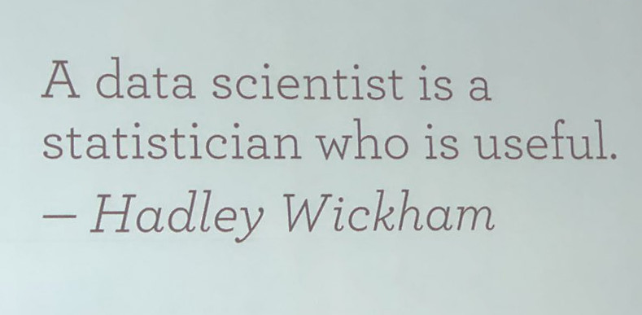
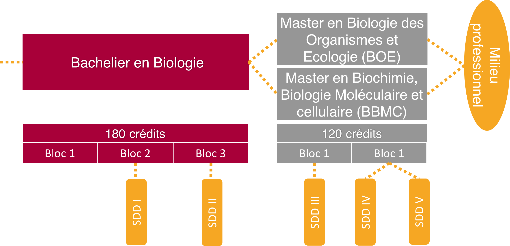
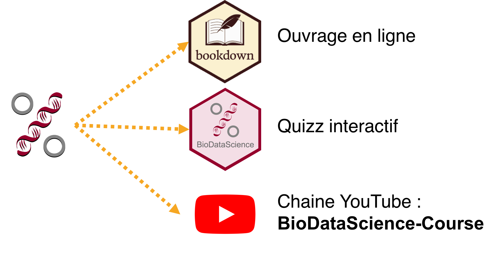

```{r setup, include=FALSE}
knitr::opts_chunk$set(echo = TRUE)
SciViews::R
```


### Contexte 

 **Crise de la reproductibilité**, **Open Science**, **Open Data**, **Open Knowledge**

Les statistiques “classiques” sont de plus en plus insuffisantes dans le contexte actuel de la recherche, à tel point qu'on parle maintenant d'une autre discipline\ : **la science des données.**




### Science des données : à l'interface entre plusieurs disciplines

\columnsbegin
\columnhalf

- La Science des Données, c'est la discipline qui s'intéresse à l'analyse de données _sous toutes ses formes_

- Très large et **interdisciplinaire** :
    + **(Bio)statistiques** et visualisation
    + Utilisation d'**outils informatiques**
    + Expertise dans le domaine (**biologie**)

- \alert{Il faut maîtriser simultanément les 3 domaines pour être un scientifique des données.}

*C'est notre objectif que nos étudiants montois en biologie se distinguent par une formation plus complète en "science des données biologiques" que dans les autres universités belges.*

\columnhalf



\columnsend

### Un job recherché




### Projet

- Formation solide en science des données
    * "Vendeur" pour attirer des étudiants vers l'UMONS
    * Avantage à nos étudiants sur le marché de l'emploi



- Classes renversées
- Cours et T.P. remplacés par des activités où les étudiants sont **(pro)actifs**
- Apprentissage en continu
- **Méthodes et matériel pédagogiques modernisés**
- Évolution vers un MOOC, version anglaise


### Processus d’apprentissage continu

L'apprentissage est réparti sur 4 années pour un total de 16 crédits (200h en présentiel)




### Biostatistique dans les universités belges

| Université   | Cours (h) | Exercices |  Total (h)  |
|:-------------|:---------:|:---------:|:-----------:|
| UCLouvain    |    36     |     39    |   75        |
| ULiège       |    65     |     30    |   95        |
| UNamur       |    41     |     74    |   115       |
| ULB          |    54     |     78    |   132       |
| UMons (*)    |    75     |    125    |   200       |

(*) Y compris SDD4 & SDD5 à option en Master

Et chez nos voisins flamands\ ?

| Université   | Cours (h) | Exercices |  Total (h)  |
|:-------------|:---------:|:---------:|:-----------:|
| VUB          |    42     |    42     |   84        |
| KUL          |    72     |    71     |   143       |
| UAntwerpen   |    ??     |    ??     |   165       |
| UGent        |    90     |   121     |   211       |


### Processus d'apprentissage actif

Il n'y a pas que le nombre d'heures qui compte. *Nous voulons rendre cet enseignement le plus qualitatif possible\ !* Contenu des cours centralisé, varié, en ligne et en constante amélioration :  <http://biodatascience-course.sciviews.org>



### En pratique 

Prenons le module 2 du cours de science des données I : visualisation et inférence (<http://biodatascience-course.sciviews.org/sdd-umons/visu1.html>)

\hfill

\hfill


\columnsbegin
\columnhalf

**Etudiant**

\hfill

- Théorie sous diverse forme

- Exercice individuelle

- Projet par équipe

\columnhalf

**Professeur**

\hfill

- [leanrR](https://rstudio.github.io/learnr/)

- [GitHub Classroom](https://classroom.github.com)

- [GitHub](https://github.com)

\columnsend

___

Progression des étudiants via les quizz et exercices en ligne.

\columnsbegin
\columnlarge


\columnsmall

**Progression des étudiants**

\hfill

Lors de la réalisation des exercices, toutes les données sont récupérées et stockées sur une base de données.

- Progression générale

- Progression individuelle

- Notez le taux de participation élevé\ !

\columnsend


### Pour aller plus loin

Prenons le module 2 du cours de science des données I : visualisation et inférence (<http://phgrosjean.sciviews.org/bookdown-test/visu1.html>)

- [shiny app](https://shiny.rstudio.com)

- [H5p](https://h5p.com)


### Diffusion

Présentation d'un poster à la conférence : Rencontres R à Rennes 2018.

[Introduction de nouveaux outils (learnr, Github classroom,. . . ) dans un cours de Science des Données Biologiques](https://github.com/BioDataScience-Course/RencontresRRennes2018)

\hfill

\alert{Grand intérêt marqué par les professeurs présents}


### Conclusion

Amélioration du point de vue **qualitatif**

- **Contenu numérique** (vidéos, quizz, exercices en ligne)
    + Intégration de ces supports intéractifs
    + Ouverture vers l'extérieur de ces supports (Moodle ? MOOC ?)
- Enregistrement de toutes les actions des étudiants dans une base de données
    + Analyse en vue d'**amélioration** des supports
    + Sujet de recherche en pédagogie ? 
- Restructuration d'un **salle info** propice à l'apprentissage actif

#### Besoins

- Evolution des outils numériques (H5P ? MOOC ?)
- Aide (SAP ? Audiovisuel ? assistant pédagogique ? ...)
- Projet de recherche associé ? 
- Promotion à l'UMONS et à l'extérieur du projet

