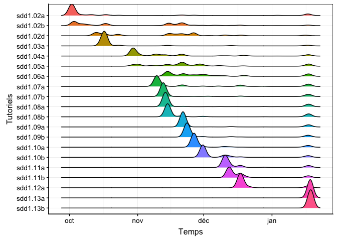

Outils de détection des difficultés des étudiants dans l'utilisation de quiz interactifs (package leanr)
================

Cette application shiny a pour objectif de proposer un outils de détection des difficultés des étudiants.

