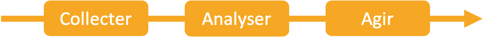

```{r setup, include=FALSE}
knitr::opts_chunk$set(echo = FALSE, warning = FALSE, message = FALSE)
SciViews::R
```

### Qui sommes-nous?

\begincols
\begincol{.50\textwidth}

Philippe Grosjean

- Professeur
- Biologiste marin
- Développeur en R

{width='65%'}

\endcol
\begincol{.50\textwidth}

Guyliann Engels

- Assistant
- Biologiste marin
- Utilisateur de R

{width='65%'}

\endcol
\endcols

### Constat

- crise de la reproductibilité 
- crise de la valeur P
- Croissance exponentielle des données

=> Nos cours de Biostatistiques sont **dépassés**

### Objectifs

**Accompagner** des étudiants afin qu'ils soient capable de réaliser les étapes suivantes de manière **reproducutible** : 

- **collecter** des données, 
- **nettoyer** des données, 
- **remanier** des données, 
- **analyser** des données,
- **communiquer** les analyses

### Enseignement revisité


### Contenu des cours

\begincols
\begincol{.50\textwidth}
**Connaissance spécialisée**

\vfill

- visualisation \& inférence
- modélisation \& analyse multivariée
- machine learning \& série spatio-temporelle

\endcol
\begincol{.50\textwidth}

**Compétence transversale**

\vfill

- recherche reproductible
- gestion de projet
- collaboration entre les étudiants
- open data

\endcol
\endcols

### Méthode d'enseignement

On veut des étudiants **actifs**

**Cours classique *ex cathedra* + séances d'exercices**


**Approche en classe inversée**


### Enseignement en continu


### Support de cours

**Cahier des charges :**

- cours centralisé,
- exercice intégré dans le cours,
- récupération des données généré par les étudiants


### Démonstration


### Données collectées

```{r}
read("data/sdd_infos.csv") %>.%
  transmute(., 
    Cours = course, `Etudiants` = user, Modules = module, H5P = h5p, Learnr = learnr,
    `Projets ind.` = `ind. github`, `Projets groupe` = `group github`) %>.%
  knitr::kable(.)
```

\vfill

 => + de 300000 entrées dans notre base de données

### Analyse de l'apprentissage

\begin{center}
\emph{Learning Analytics (LA) : can be defined as the measurement, collection, analysis, and reporting of data about learners and their contexts, for purposes of understanding and optimizing learning and the environments in which it occurs (Lang, Siemens, Wise, \& Gasevic, 2017)}
\end{center}

\vfill



### Suivi en temps réel


### Evaluation

```{r, fig.height= 2.5}
read("data/sdd_eval.csv") %>.%
  mutate(., course_year = paste0(course, " (", acad_year, ")")) %>.%
  chart(., exam ~ result | course_year) +
  geom_vline(xintercept = 5, alpha = 0.3) +
  geom_hline(yintercept = 5, alpha = 0.3) +
  geom_jitter(alpha = 1, width = 0.05, height = 0.05, show.legend = FALSE) +
  ylim(c(0,10)) +
  xlim(c(0,10)) +
  labs(y = "Note de l'examen (/10)", x = "Note des projets (/10)") +
  theme(aspect.ratio = 1)
```

### Amélioration des exercices

```{r, fig.height= 3}
read("data/sdd_log.csv") %>.%
  filter(., course == "B" & term == "Q2") %>.%
  mutate(., change = if_else(change>1500, 1500, change)) %>.%
  chart(., change ~ app %fill=% type) +
  geom_boxplot() +
  coord_flip() +
  labs(y = "Somme des lignes modifées", x = "Projets")
```

### Conclusion

\begin{center}
\textbf{Avez-vous des questions ?}
\end{center}

**Ressources utiles**

- Site web : <https://wp.sciviews.org/>
- sdd_admin : bookdown sur nos outils <https://github.com/BioDataScience-Course/sdd-admin>
- {learnitdown} : <https://www.sciviews.org/learnitdown/>
