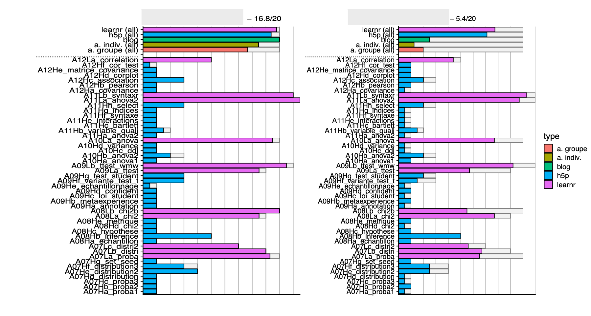

```{r setup, include=FALSE}
knitr::opts_chunk$set(echo = FALSE, warning = FALSE, message = FALSE)
SciViews::R
```

### Qui sommes-nous?

\begincols
\begincol{.50\textwidth}

Philippe Grosjean

- Professeur 
- Biologiste marin
- Développeur en R

{width='65%'}

\endcol
\begincol{.50\textwidth}

Guyliann Engels

- Assistant
- Biologiste marin
- Utilisateur de R

{width='65%'}

\endcol
\endcols

### Constat

\begincols
\begincol{.50\textwidth}

- croissance exponentielle des données
- crise de la reproductibilité 
- crise de la valeur P

\endcol
\begincol{.50\textwidth}

\includegraphics[width=1\linewidth]{figures/bigdata.png}

\endcol
\endcols

\vfill

=> Nos cours de Biostatistiques sont **dépassés**

### Objectifs

**Accompagner** les étudiants afin qu'ils soient capable de réaliser les étapes suivantes de manière **reproductible** :

- **collecter** des données, 
- **nettoyer** des données, 
- **remanier** des données, 
- **analyser** des données,
- **communiquer** les résultats,
- **développer** un esprit critique.


### Enseignement revisité


### Contenu des cours de science des données à l'Université de Mons

\begincols
\begincol{.50\textwidth}
**Connaissances spécialisées**

\vfill

- visualisation \& inférence
- modélisation \& analyse multivariée
- machine learning \& séries spatio-temporelles

\endcol
\begincol{.50\textwidth}

**Compétences transversales**

\vfill

- recherche reproductible
- gestion de projet
- collaboration entre étudiants
- open data

\endcol
\endcols

### Méthode d'enseignement

On veut des étudiants **actifs**

**Cours classique *ex cathedra* + séances d'exercices**


**Approche en classe inversée**


### Enseignement en continu


### Support de cours

\begin{center}
\textbf{Cahier des charges}
\end{center}

- cours centralisé,
- exercices intégrés dans le cours,
- récupération des données générées par les étudiants


\begin{center}
\textbf{Outils}


\includegraphics{figures/svbox.png}


Machine virtuelle précongifurée qui comprend R, Rstudio, git et plus de 1200 packages utiles dnas la science des données
\end{center}

### Démonstration


### Données collectées

```{r}
read("data/sdd_infos.csv") %>.%
  transmute(., 
    Cours = course, `Etudiants` = user, Modules = module, H5P = h5p, Learnr = learnr,
    `Projets ind.` = `ind. github`, `Projets groupe` = `group github`) %>.%
  knitr::kable(.)
```

\vfill

 => En 2020-2021, + de **450.000 entrées** pour 130 étudiants

### Analyse de l'apprentissage

\begin{center}
\emph{Learning Analytics (LA) : can be defined as the measurement, collection, analysis, and reporting of data about learners and their contexts, for purposes of understanding and optimizing learning and the environments in which it occurs (Lang, Siemens, Wise, \& Gasevic, 2017)}
\end{center}

\vfill


### Construction de la note



### Quantification de la charge de travail

```{r, fig.height= 3}
read("data/sdd_log.csv") %>.%
  filter(., course == "B" & term == "Q2") %>.%
  mutate(., change = if_else(change>1500, 1500, change)) %>.%
  chart(., change ~ app %fill=% type) +
  geom_boxplot() +
  coord_flip() +
  labs(y = "Lignes modifiées", x = "Projets")
```

### Avez-vous des questions ?

\begin{center}
\textbf{Ressources utiles}
\end{center}

\vfill

- Site web : <https://wp.sciviews.org/>
- sdd_admin : bookdown sur nos outils <https://github.com/BioDataScience-Course/sdd-admin>
- {learnitdown} : <https://www.sciviews.org/learnitdown/>

\vfill

\begin{center}
\includegraphics[width=.16\textwidth,height=.2\textheight]{template/EcoNum-logo.pdf}  \includegraphics[width=.16\textwidth,height=.2\textheight]{template/biodatascience.png}
\end{center}


