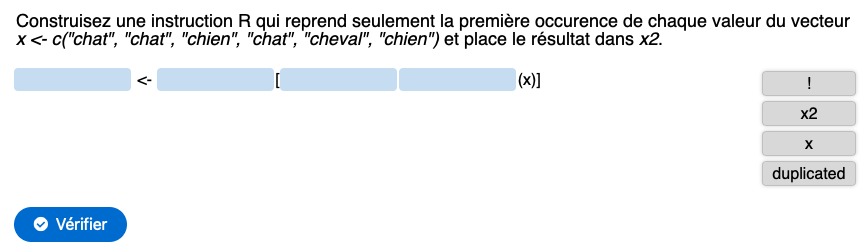

```{r setup, include=FALSE}
knitr::opts_chunk$set(echo = FALSE, warning = FALSE, message = FALSE)
#SciViews::R
```

### Contexte

**Cours de science des données biologiques à l'Université de Mons** (https://wp.sciviews.org), cf. présentation précédente de Guyliann Engels

\vfill

- Méthode pédagogique, comment **apprendre**\ ?

\vfill

- **Perception** des étudiants face à l'environnement logiciel (R, RStudio, R Markdown & GitHub)

## Apprendre

### Apprendre, niveau 0.x

Cours en amphis, vidéos, "textbooks", ... = apprenants **passifs**


### Apprentissage, niveau 1\ ?

Script R de démo => apprenants **exécutent** et **réutilisent** sur d'autres données


\begincols
\begincol{.50\textwidth}

**Monkey see, monkey do**

\vfill

 

Proverbe en pidgin jamaïcain

Imitation sans réfléchir

\endcol
\begincol{.50\textwidth}

{width='65%'}

\endcol
\endcols


### Apprendre... vraiment, un processus complexe


### Apprendre, niveaux 1 à 4

{width='80%'}


### Quatre niveaux d'exercices

{width='80%'}


### Exemple: retirer les premiers éléments uniques (vecteur ou tableau)

Jeu de données exemple dans la variable `ex`:

```{r}
set.seed(477)
ex <- tibble::tibble(
  month = sample(month.name, size = 10, replace = TRUE),
  value = rnorm(10)
)
```

```{r, echo=TRUE}
head(ex, n = 5)
```

Je veux récupérer la première ligne pour chaque mois du tableau.

---

Résolution avec tidyverse ({dplyr}) pour un tableau:

```{r, echo=TRUE}
library(tidyverse)
ex %>%
  group_by(month) %>%
  slice_head(n = 1)
```

**Notez ceci:**

- L'ordre des éléments dans le tableau final a changé (ordre alphabétique),
- Cela ne fonctionne pas pour un vecteur


### Le même... mais en R de base (ordre sans importance)

En R de base, vous pouvez utiliser la fonction `duplicated()`.


### Niveau 1 : faire

Facile, ludique, mais un rien plus évolué que le "bête" recopiage. Exercice **H5P**. 

Exemple : https://h5p.org/node/1193264



**TODO:** QR code pour l'exercice.


### Niveau 2 : appliquer

Mise en situation, code R exécutable et vérifiable : **tutoriel learnr**.

**TODO:** lien vers le tutoriel de démo + effectuer l'exercice dedans...


### Niveau 3 : transférer

Être capable de transférer le principe vu dans un **contexte différent**.

\vfill

Dans nos cours\ : **projets individuels** dans GitHub / RStudio.

\vfill

*Exemple\ : le jeu de données à analyser implique de récupérer la première occurrence pour chaque type d'évènment.*

**TODO:** retravailler et illustrer cette dia.


### Niveau 4 : créer

**Inventer des nouvelles utilisations du concept.**

\vfill

Dans nos cours, **projets de groupe** (mobiliser l'**intelligence collective**).

*Exemple\ : dans un projet, devoir extraire le premier évènement pour chaque utilisateur et chaque mois\ ?*


## Perception

### Charge cognitive des learnrs

...


### Utilisabilité du logiciel R + RStudio

...


### État émotionnel général

...


### Conclusions

...

___

\begin{center}
\textbf{Avez-vous des questions ?}
\end{center}

\centering

{width='30%'}

\vfill

**Ressources utiles**

- Site web du cours \: <https://wp.sciviews.org/>
- {learnitdown}\ : <https://www.sciviews.org/learnitdown/>
- cette présentation\ : <https://github.com/BioDataScience-Course/sdd_presentations/tree/master/2021_rencontresr_paris>
