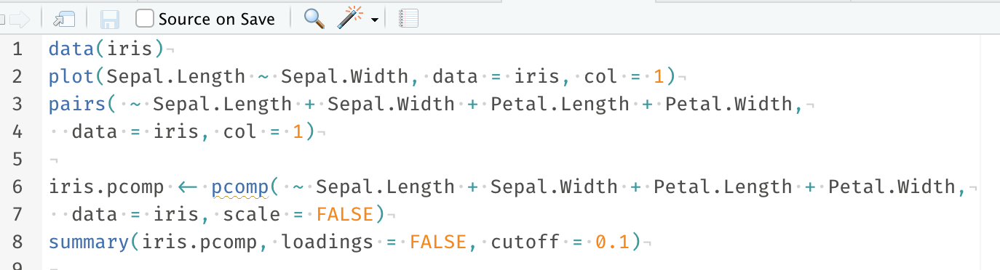
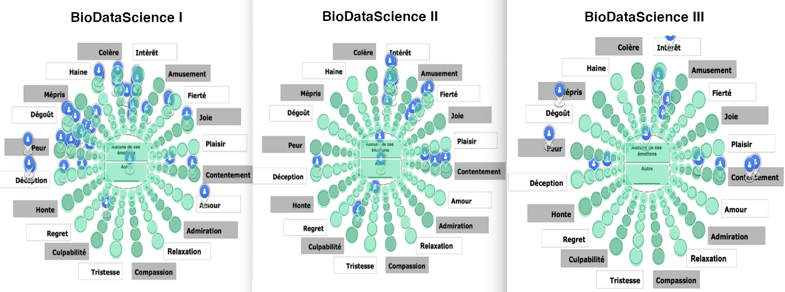

```{r setup, include=FALSE}
knitr::opts_chunk$set(echo = FALSE, warning = FALSE, message = FALSE)
#SciViews::R
```

### De quoi allons-nous parler ?

**Cours de science des données biologiques à l'Université de Mons** (https://wp.sciviews.org), cf. présentation précédente de Guyliann Engels

\vfill

- Méthode pédagogique, comment **apprendre**\ ?

\vfill

- **Perception** des étudiants face à l'environnement logiciel (R, RStudio, R Markdown & GitHub)

## Apprendre

### Apprendre, niveau 0.x

Cours en amphis, vidéos, ... = apprenants **passifs**


### Apprentissage, niveau 1\ ?

Script R de démo => apprenants **exécutent** et **réutilisent** sur d'autres données



\begincols
\begincol{.50\textwidth}

**Monkey see, monkey do**

\vfill

 

Proverbe en pidgin jamaïcain

Imitation sans réfléchir

\endcol
\begincol{.50\textwidth}

{width='65%'}

\endcol
\endcols


### Apprendre : s'appuyer sur la science

\begincols
\begincol{.50\textwidth}


\endcol
\begincol{.50\textwidth}

28 recherches clés sur la compréhension du mécanisme de l'apprentissage.

\vfill

 

"How to learn effectively, efficiently, and enjoyably."

\endcol
\endcols


### Apprendre, niveaux 1 à 4

{width='80%'}


### Quatre niveaux d'exercices

{width='80%'}


### Exemple : retirer les premiers éléments uniques (vecteur ou tableau)

Jeu de données exemple dans la variable `ex`:

```{r}
set.seed(477)
ex <- tibble::tibble(
  month = sample(month.name, size = 10, replace = TRUE),
  value = rnorm(10)
)
```

```{r, echo=TRUE}
head(ex, n = 5)
```

Je veux récupérer la première ligne pour chaque mois du tableau.


### Résolution en R de base

En R de base, vous pouvez utiliser la fonction `duplicated()`.


### Niveau 1 : faire

Exercice **H5P** (**https://go.sciviews.org/h5p_duplicated**). Facile, ludique, mais un rien plus évolué que le "bête" recopiage.


### Niveau 2 : appliquer

Code R exécutable et vérifiable. 5 à 10 exercices dans un **tutoriel learnr**. Exemple disponible à **https://go.sciviews.org/learnr_duplicated** 

*(sauver en duplicated.Rmd, ouvrir dans RStudio et cliquer sur "Run Document").*


### Niveau 3 transférer & 4 créer

- Application du principe **en situation** (analyse de données).

- Le niveau 4 nécessite d'inventer une variante (ex.\ : retirer les premières occurrences en fonction de deux ou plusieurs colonnes simultanément).

\vfill

Dans nos cours\ : **projets individuels et de groupe** dans GitHub / RStudio.


## Perception

### Charge cognitive des learnrs (NASA-TLX, Hart & Staveland 1988)


### Charge cognitive perçue des learnrs


### Perception générale (roue des émotions de Genève)


### Perception générale - résultats




### Perception du logiciel (System Usability Scale, Brooke 2013)

\centering

{width='75%'}


### Interprétation de l'échelle SUS

Sur base de plusieurs centaines d'utilisation, une échelle indicative se dégage (Brooke 2013, SUS: a retrospective).

\vfill

Attention\ : **utilisabilité** différent d'utilité\ !

\vfill

\begincols
\begincol{.50\textwidth}

**SUS**

- 25

- 39

- 52

- **68**

- 73

- 86

- 100

\endcol
\begincol{.50\textwidth}

**Utilisabilité**

- pire imaginable

- mauvais

- acceptable

- **score moyen**

- bon

- excellent

- meilleur imaginable

\endcol
\endcols


### SUS logiciel R + RStudio - résultats


### Conclusions

- Apprentissage **actif** en plusieurs **étapes** de difficultés croissantes

- Tutoriels **learnr** efficaces pour *appliquer* (niveau 2)\ ; Charge cognitive perçue moyenne

- Beaucoup de concepts nouveaux au premier cours\ : **émotions générales** négatives qui évoluent en positif aux cours suivants

- Projets individuels et en groupe avec **R, RStudio et GitHub**\ : utilisabilité perçue plutôt faible

___

\begin{center}
\textbf{Avez-vous des questions ?}
\end{center}

\centering

{width='30%'}

\vfill

**Ressources utiles**

- Site web du cours \: <https://wp.sciviews.org/>
- {learnitdown}\ : <https://www.sciviews.org/learnitdown/>
- cette présentation\ : <https://github.com/BioDataScience-Course/sdd_presentations/tree/master/2021_rencontresr_paris>
