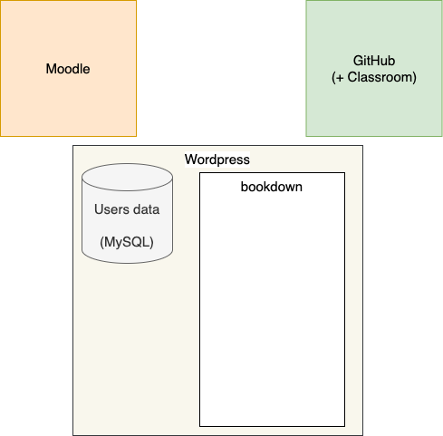
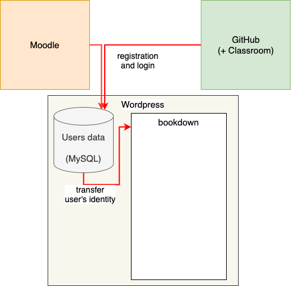
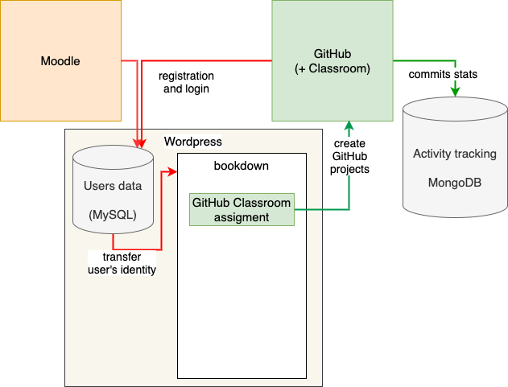
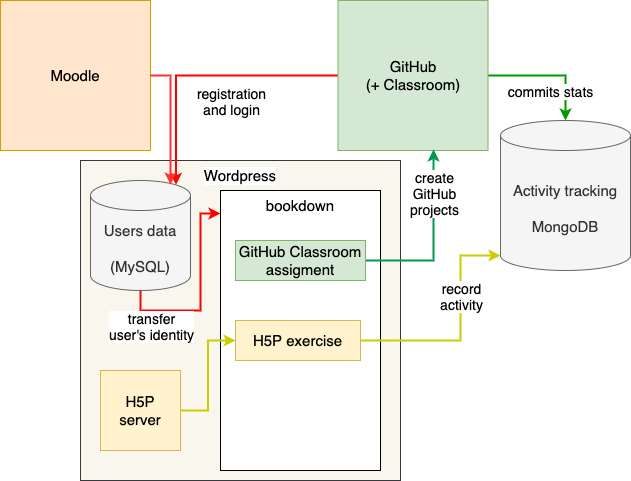
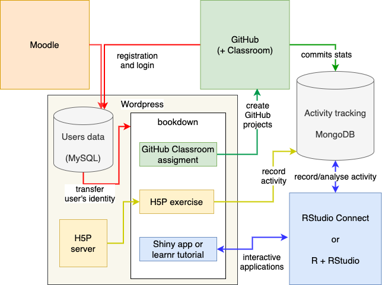
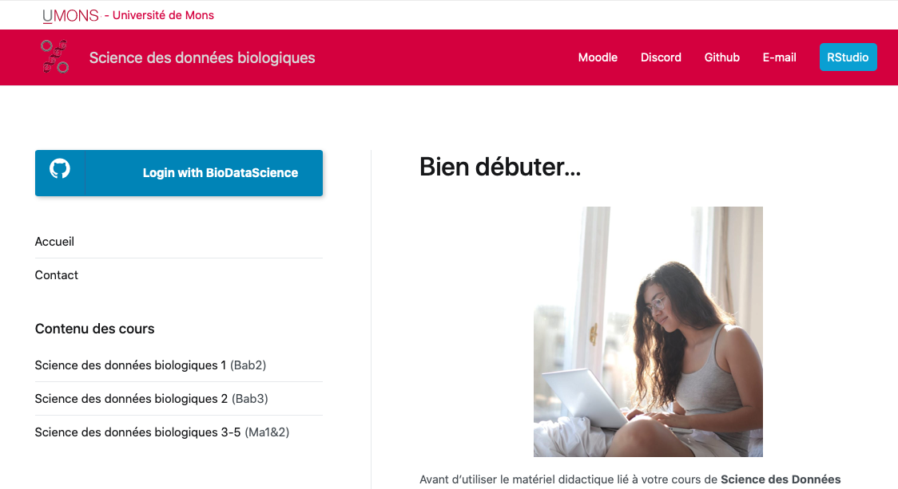

# Context

✅ Nice components available: R, RStudio, learnr, <br/>
Shiny, H5P, GitHub (Classroom), ...

--

❌ No integration of these components

--

❌ No activity tracking

--

❌ No identification of the users

--

=> **{learnitdown}**  

---

# Teaching Platform



---

# Teaching Platform



---

# Teaching Platform



---

# Teaching Platform



---

# Teaching Platform



---

# Example

Data Science course at the University of Mons, Belgium.

```{r echo=FALSE, out.width=750}

```

---

class: center, middle

# Thanks!

{learnitdown} package: https://www.sciviews.org/learnitdown/.
 
 <br/>

Example of course: https://wp.sciviews.org (in French)

