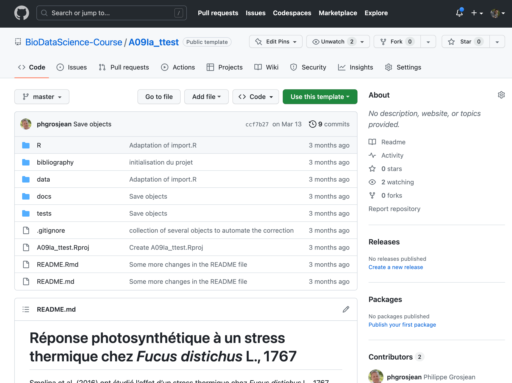

```{r setup, include=FALSE}
knitr::opts_chunk$set(echo = FALSE, warning = FALSE, message = FALSE)
#SciViews::R
```

### Qui sommes-nous?

```{=tex}
\begincols
\begincol{.50\textwidth}
```
Philippe Grosjean

-   Professeur
-   Biologiste marin
-   Développeur en R

{width="65%"}

```{=tex}
\endcol
\begincol{.50\textwidth}
```
Guyliann Engels

-   Assistant
-   Biologiste marin
-   Utilisateur de R

{width="55%"}

```{=tex}
\endcol
\endcols
```
### Cours de sciences des données biologiques

```{=tex}
\begin{center}
https://wp.sciviews.org/
\end{center}
```


### Méthode d'enseignement

On veut des étudiants **actifs**

**Cours classique *ex cathedra* + séances d'exercices**


**Approche en classe inversée**


### Quatre niveaux d'exercices

{width="80%"}

### Gestion des projets

Projet RStudio hebergé sur github sous la forme d'un template. : <https://github.com/BioDataScience-Course/A09Ia_ttest>

Github Classroom permet à chaque étudiant de générer une copie dans notre organisation github du projet template.

{width="100%"}

### Structuration du document

```{=tex}
\begincols
\begincol{.70\textwidth}
```
{width="100%"}

```{=tex}
\endcol
\begincol{.30\textwidth}
```
Un document Rmarkdown contenu dans un projet RStudio sur un dépot github :

<https://github.com/BioDataScience-Course/A09Ia_ttest>

\vfill

-   des consignes sous la forme de commentaires

-   des noms de chunks ou des niveaux de titres comme des balises.

```{=tex}
\endcol
\endcols
```
### Comment corriger ces projets ?

Cas pratique : A09Ia_22M_ttest

```{=tex}
\begincols
\begincol{.30\textwidth}
```
-   50 projets

    -   avec 1 document Rmarkdown

-   50 grilles de corrections

    -   avec 26 critères (code R, interpétation de graphique, ...)

\vfill

```{=tex}
\endcol
\begincol{.70\textwidth}
```
{width="100%"}

```{=tex}
\endcol
\endcols
```
Total : 1300 critères note et commentaire à compléter

<!-- Faire un dia de transition qui exprime toute la réflexion sur comment faire pour corriger 50 projets RStudio. avec des  grilles d'évaluation ? -->

### {learnitgrid}

Notre solution : {learnitgrid} <https://github.com/SciViews/learnitgrid>

-   create_context() : une liste contenant toutes les informations sur les projets à corriger
-   populate_table() : regrouper toutes les informations dans un tableau pour réaliser la correction

=\> Une application shiny permettant la correction en série.

### Démonstration : {learnitgrid}

{width="100%"}

### Avez-vous des questions ?

```{=tex}
\begin{center}
\textbf{Ressources utiles}
\end{center}
```
\vfill

-   Site web du cours : <https://wp.sciviews.org/>
-   {learnitgrid} : <https://github.com/SciViews/learnitgrid>
-   {learnitdown} : <https://www.sciviews.org/learnitdown/>
-   Cette présentation : <https://github.com/BioDataScience-Course/sdd_presentations/tree/master/2023_rencontresr_avignon>

\vfill

```{=tex}
\begin{center}
\includegraphics[width=.16\textwidth,height=.2\textheight]{template/EcoNum-logo.pdf} 
\includegraphics[width=.16\textwidth,height=.2\textheight]{template/SciViews-logo.pdf} \includegraphics[width=.16\textwidth,height=.2\textheight]{template/biodatascience.png}
\end{center}
```
