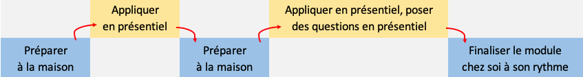
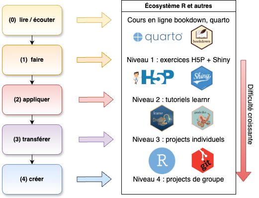

```{r setup, include=FALSE}
knitr::opts_chunk$set(echo = FALSE, warning = FALSE, message = FALSE)
```

### Enseigner R et les statistiques à des étudiants réfractaires

\putabs{10.5cm}{-0.5cm}{\includegraphics[width=1.5cm]{template/biodatascience.png}}

Cursus universitaire en biologie, voir \alert{\underline{https://wp.sciviews.org}}.

\vfill

{width='65%'}

## Motiver et capter l'attention

### Contextualiser - décontextualiser - recontextualiser


*Tardif J., Meirieu P., 1996, Stratégies pour favoriser le transfert des connaissances. Vie pédagogique, 98, 4-7.*

### Pédagogie active en classe inversée

**Cours + exercices** = étudiants passifs une partie du temps


\vfill

**Classe inversée** = étudiant actif et optimisation du temps en présentiel



Découpage du cours en **modules** de 2 séances (2h + 4h) toutes les 2 semaines. 

### Classe inversée - attention !

-   Pas juste une vidéo du cours à visionner !

-   Être disponible pour \alert{répondre aux questions} (coaching).

-   Matériel pédagogique en ligne \alert{adapté}, visant l'*auto-apprentissage* et l'*auto-évaluation* (\alert{exercices interactifs}, [H5P](https://h5p.org) et [learnr](https://rstudio.github.io/learnr/)).


### Manque de participation

Exemple : exercices interactifs en ligne proposés sans précautions particulières

{width='80%'}

### Participation - des solutions...

-   Exercices directement dans le cours en ligne


\vfill

### Participation - des solutions...

-   Exercices directement dans le cours en ligne

-   Liste des exercices à la fin de chaque module

{width='80%'}


### Participation - des solutions...

-   Exercices directement dans le cours en ligne

-   Liste des exercices à la fin de chaque module

-   Points attribués à la réalisation des exercices (exemple, 5% de la note finale)

{width='60%'}


### Participation - des solutions...

-   Exercices directement dans le cours en ligne

-   Liste des exercices à la fin de chaque module

-   Points attribués à la réalisation des exercices (exemple, 5% de la note finale)

-   Rapport de progression en temps réel

{width='85%'}

### Participation - résultat

\putabs{10.5cm}{-0.5cm}{\includegraphics[width=1.5cm]{template/biodatascience.png}}

**Plus de 90%** de participation observée aux exercices

{width='80%'}


## Progressivité de l'apprentissage

### Évaluation continue

\putabs{10.5cm}{-0.5cm}{\includegraphics[width=1.5cm]{template/biodatascience.png}}

Évaluation formative tout au long du cours divisé en modules

\vfill


### Progressivité en 4 niveaux d'exercices

\putabs{10.5cm}{-0.5cm}{\includegraphics[width=1.5cm]{template/biodatascience.png}}

{width='80%'}

### Projets GitHub Classroom cadrés

\putabs{10.5cm}{-0.5cm}{\includegraphics[width=1.5cm]{template/biodatascience.png}}

{width='70%'}

### Projets GitHub Classroom cadrés

\putabs{10.5cm}{-0.5cm}{\includegraphics[width=1.5cm]{template/biodatascience.png}}

- Instructions sous forme de commentaires

\vfill

{width='80%'}

\vfill

### Projets GitHub Classroom cadrés

\putabs{10.5cm}{-0.5cm}{\includegraphics[width=1.5cm]{template/biodatascience.png}}

- Instructions sous forme de commentaires

- Interprétation par sélection des phrases correctes

{width='80%'}

### Projets GitHub Classroom cadrés

\putabs{10.5cm}{-0.5cm}{\includegraphics[width=1.5cm]{template/biodatascience.png}}

- Instructions sous forme de commentaires

- Interprétation par sélection des phrases correctes

- Évaluation semi-automatique avec {testthat} + suggestions pour s'améliorer

{width='80%'}

### Correction des projets (grilles critériées)

100 étudiants * 10 projets * 30 critères = 30.000 évaluations !

{width='100%'}

### Plateforme pédagogique LearnIt::R

\putabs{10.5cm}{-0.5cm}{\includegraphics[width=1.5cm]{figures/learnitr_800.png}}

La \alert{plateforme pédagogique LearnIt::R} :

-   Exercices H5P , Shiny, learnr dans un bookdown (+ Quarto book bientôt)

-   Enregistrement de l'activité des étudiants dans les exercices en ligne

-   Rapport de progression en temps réel

-   Projets GitHub Classroom cadrés avec auto-évaluation {testthat}

-   Application \alert{learnitgrid} de correction par grilles critériées

### Quatre niveaux d'exercices avec LearnIt::R

{width='100%'}

___

\begin{center}
\textbf{Avez-vous des questions ?}
\end{center}

\centering

{width='30%'}

\vfill

**Ressources utiles**

\alert{Plateforme pédagogique LearnIt::R}}: <https://github.com/learnitr>

*en cours d'élaboration sur base des outils développés pour nos cours*

- Site web du cours : <https://wp.sciviews.org/>

- Cette présentation : <https://go.sciviews.org/rr2024>
