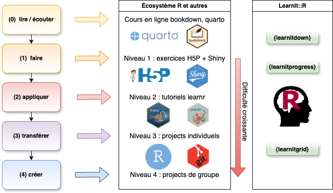

```{r setup, include=FALSE}
knitr::opts_chunk$set(echo = FALSE, warning = FALSE, message = FALSE)
```

### Enseigner R et les statistiques à des étudiants réfractaires

\vfill

Cursus universitaire en biologie, voir [\alert{\underline{https://wp.sciviews.org}}](https://wp.sciviews.org)

\vfill

{width='65%'}

## Motiver et capter l'attention


### Exercices facultatifs - peu de participation

Cours de math, exercices interactifs en ligne proposés sans précautions particulières

{width='80%'}

### Participation - des solutions...

**Varier** le type d'exercices : **\alert{H5P}**

- Plus de 50 types d'exercices différents, voir [https://h5p.org](https://h5p.org/)

\vfill

{width='100%'}

\vfill

\vfill

\vfill

### Participation - des solutions...

**Varier** le type d'exercices : **H5P** + **\alert{learnr}**

- Tutoriels avec écriture de code R, voir [https://rstudio.github.io/learnr/](https://rstudio.github.io/learnr/)

\vfill

{width='100%'}

\vfill

### Participation - des solutions...

**Varier** le type d'exercices : **H5P** + **learnr** + **\alert{Shiny}**

- Démonstration de concepts statistiques avec [https://shiny.rstudio.com/](https://shiny.rstudio.com/)

{width='80%'}

### Participation - des solutions...

-   Exercices directement **dans le cours en ligne**


\vfill

### Participation - des solutions...

-   Exercices directement dans le cours en ligne

-   **Liste des exercices** à la fin de chaque module

{width='80%'}


### Participation - des solutions...

-   Exercices directement dans le cours en ligne

-   Liste des exercices à la fin de chaque module

-   **Points attribués à la réalisation des exercices** (exemple, 5% de la note finale)

{width='60%'}


### Participation - des solutions...

-   Exercices directement dans le cours en ligne

-   Liste des exercices à la fin de chaque module

-   Points attribués à la réalisation des exercices (exemple, 5% de la note finale)

-   **Rapport de progression** en temps réel

{width='85%'}

### Participation - résultat

**Plus de 90%** de participation observée aux exercices en ligne de nos cours

{width='80%'}


## Progressivité de l'apprentissage

### Progressivité : 4 niveaux de difficulté croissante

{width='80%'}

### Projets GitHub Classroom cadrés

{width='70%'}

### Projets GitHub Classroom cadrés

- **Instructions** sous forme de commentaires

\vfill

{width='80%'}

\vfill

### Projets GitHub Classroom cadrés

- Instructions sous forme de commentaires

- Interprétation par **sélection des phrases correctes**

{width='80%'}

### Projets GitHub Classroom cadrés

- Instructions sous forme de commentaires

- Interprétation par sélection des phrases correctes

- **Évaluation semi-automatique** avec {testthat} + suggestions pour s'améliorer

{width='80%'}

### Correction des projets (grilles critériées)

100 étudiants * 10 projets * 30 critères = 30.000 évaluations !

{width='100%'}

### Plateforme pédagogique LearnIt::R

{width='100%'}

___

\begin{center}
\textbf{Avez-vous des questions ?}
\end{center}

\centering

{width='20%'}

\vfill

**Plateforme pédagogique LearnIt::R** : [\underline{\alert{https://github.com/learnitr}}](https://github.com/learnitr)

*en cours d'élaboration sur base du code développé pour nos cours*

\vfill

- Site web du cours : [\alert{https://wp.sciviews.org/}](https://wp.sciviews.org/)

- Cette présentation : [\alert{https://go.sciviews.org/rr2024}](https://go.sciviews.org/rr2024)
