```{r setup, include=FALSE}
knitr::opts_chunk$set(echo = FALSE, warning = FALSE, message = FALSE)
```

### Objectifs pédagogiques principaux des cours de SDD

-   **Connaître** des outils informatiques et statistiques utiles pour manipuler des données biologiques

-   **Comprendre** la logique des analyses statistiques

-   **Appliquer** ces analyses à de nouvelles données biologiques

-   **Analyser** et **interpréter** les résultats de ces analyses (en groupes)

-   En bonus, pour les meilleurs : **évaluer** de manière critique les conclusions d'une analyse statistique

*Ceci correspond aux niveaux 1 à 4 (ou à 5) de la taxonomie de Bloom révisée par Anderson et Krathwohl (2001). Seule le dernier niveau (créer) n'est pas explicitement visé dans les trois premiers cours (mais abordé dans le quatrième cours à option).*

### Objectifs pédagogiques (par rapport à Anderson & Krathwohl 2001)

{width="75%"}

## Sondage de data scientists avec Wooclap

### Question : mode d'apprentissage préféré

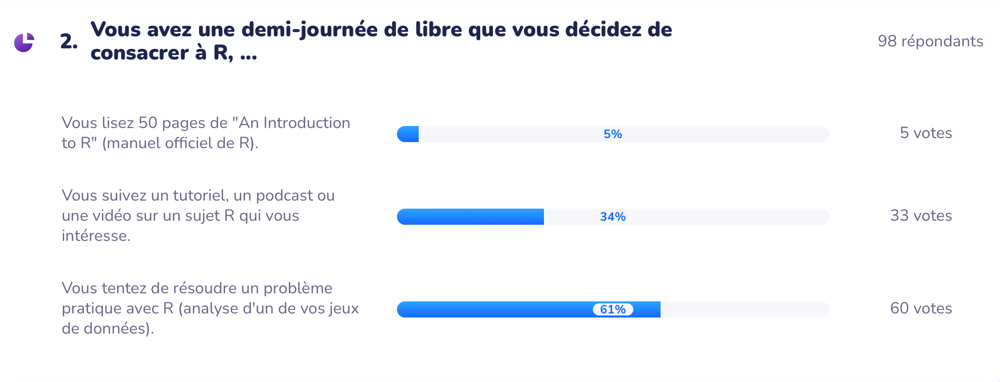

### Question ouverte

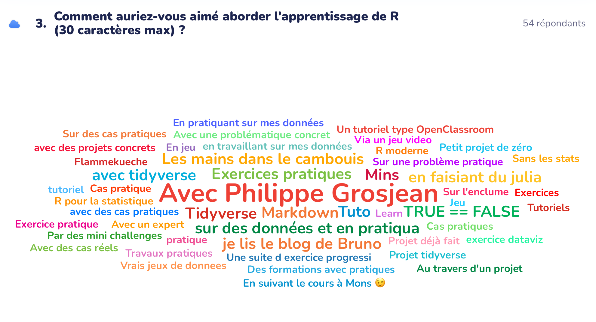

### Conséquences : axer un maximum sur la pratique !

-   Apprentissage en classe inversée (*un cours purement théorique avant des exercices pratiques ne sert à rien ; **les étudiants n'enregistrent rien***)

-   **Exercices en ligne** pour l'autoévaluation

-   **Projets** avec analyse de données biologiques réelles comme **activité principale en présentiel**

*Ceci a nécessité la réécriture complète du matériel pédagogique de nos cours de science des données : PowerPoints utilisés durant les cours théoriques remplacés par du matériel d'auto-apprentissage en classe inversée.*

### Contextualiser - décontextualiser - recontextualiser

Exemple pratique qui introduit un concept quasi-systématiquement dans le cours en ligne. Recontextualisation en séance.

{width="100%"}

### Matériel pédagogique en ligne

Cours et exercices à l'adresse : [\alert{\underline{https://wp.sciviews.org}}](https://wp.sciviews.org)

Plus de **900 pages** de cours, plus de **600 exercices** en ligne, **40 projets** individuels cadrés autocorrigés, **évaluation sur plus de 360 critères** pour chaque étudiant, LRS enregistrant plus de **800.000 évènements** annuellement (et 5 ans de travail !)

\vfill

{width="65%"}

## Motiver et capter l'attention

### Exercices facultatifs - peu de participation

Cours de math, exercices interactifs en ligne proposés sans précautions particulières

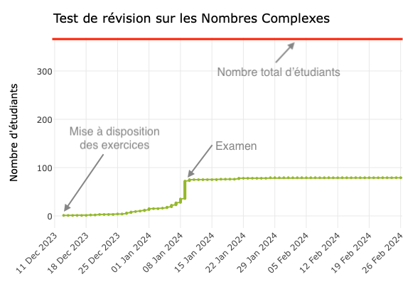{width="80%"}

### Participation - des solutions...

**Varier** le type d'exercices : \alert{H5P}

-   Plus de 50 types d'exercices différents, voir [https://h5p.org](https://h5p.org/)

\vfill

{width="100%"}

\vfill

\vfill

\vfill

### Participation - des solutions...

**Varier** le type d'exercices : **H5P** + \alert{learnr}

-   Tutoriels avec écriture de code R, voir <https://rstudio.github.io/learnr/>

\vfill

{width="100%"}

\vfill

### Participation - des solutions...

**Varier** le type d'exercices : **H5P** + **learnr** + \alert{Shiny}

-   Démonstration de concepts statistiques avec <https://shiny.rstudio.com/>

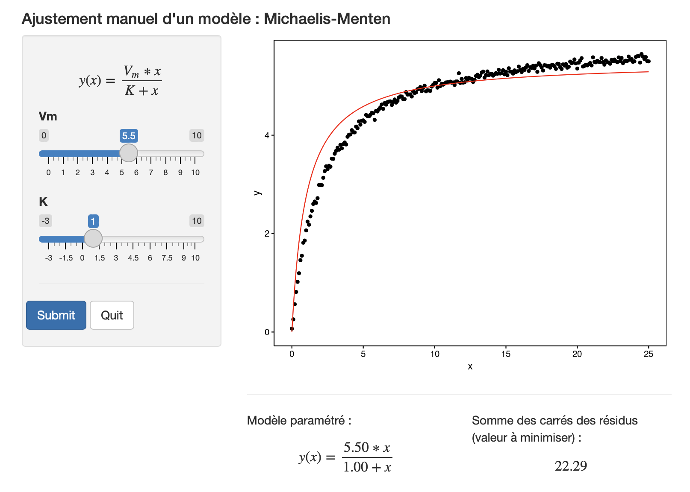{width="80%"}

### Participation - des solutions...

-   Exercices directement **dans le cours en ligne**

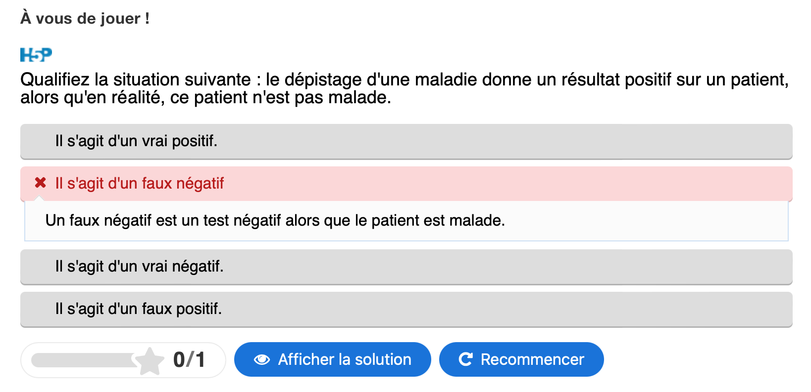

\vfill

### Participation - des solutions...

-   Exercices directement dans le cours en ligne

-   **Liste des exercices** à la fin de chaque module

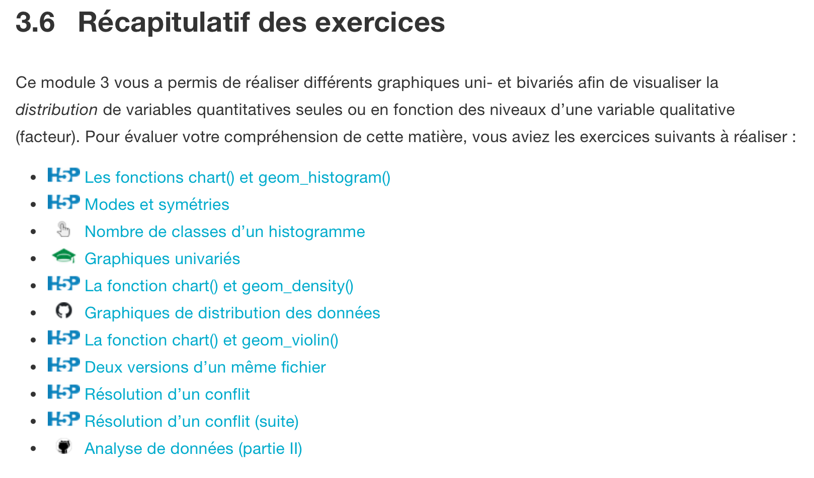{width="80%"}

### Participation - des solutions...

-   Exercices directement dans le cours en ligne

-   Liste des exercices à la fin de chaque module

-   **Points attribués à la réalisation des exercices** (exemple, 6% de la note finale)

{width="60%"}

### Participation - des solutions...

-   Exercices directement dans le cours en ligne

-   Liste des exercices à la fin de chaque module

-   Points attribués à la réalisation des exercices (exemple, 6% de la note finale)

-   **Rapport de progression** en temps réel

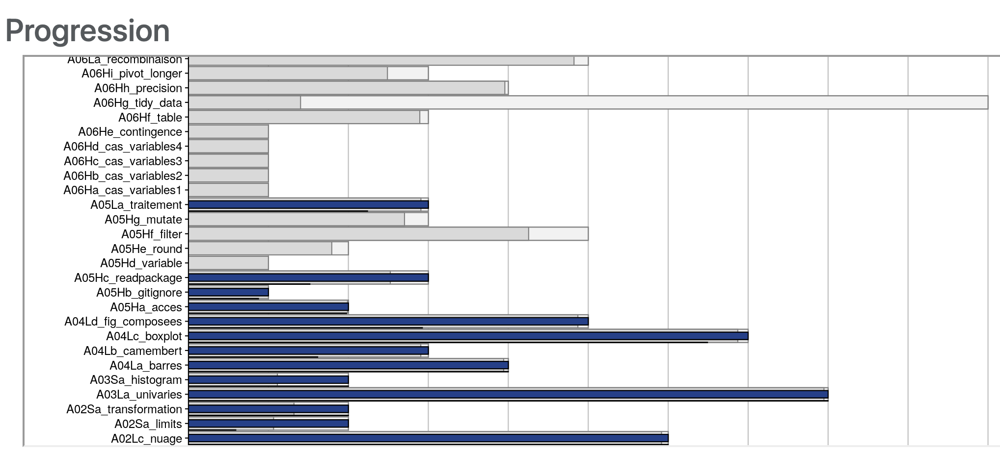{width="85%"}

### Participation - résultat

**Plus de 90%** de participation observée aux exercices en ligne de nos cours

{width="80%"}

## Progressivité de l'apprentissage

### Progressivité : formation sur 4 années (200h présentiel, 500h total)

-   **SDD I** en Bab2 : 10 modules, 70h présentiel (avec remédiation), 7 ects
-   **SDD II** en Bab3 : 10 modules, 60h présentiel, 6 ects
-   **SDD III** en Ma1 : 5 modules, 30h présentiel, 3 ects
-   **SDD IV (option)** en Ma2 : 5 modules, 30h présentiel, 3 ects

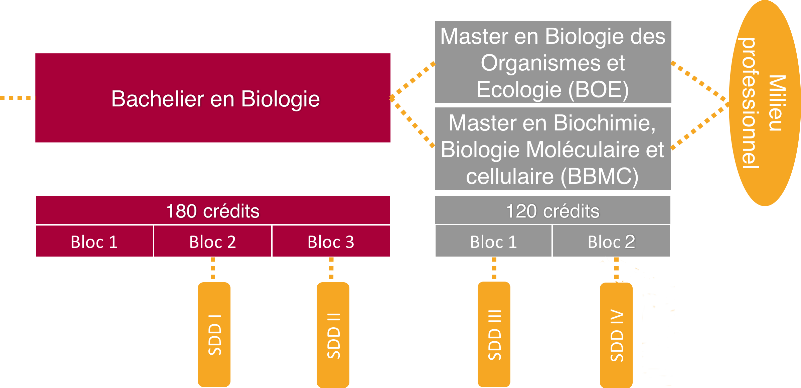

### Progressivité : 4 niveaux de difficulté croissante

{width="100%"}

### Progressivité : découpage en 30 modules

-   Chaque module est travaillé pendant **une semaine**

-   **Deux séances de 2h et de 4h** en présentiel, respectivement et 12 à 15h de travail au total pour l'étudiant (= 0.5 ECTS) par module

-   Un module **une semaine sur deux** pour laisser le temps aux étudiants de finaliser le précédent et de préparer le suivant

{width="80%"}

### Évaluation continue

**Évaluation continue** prenant en compte **toute l'activité des étudiants** (\>360 notes) :

-   Exercices N1 & 2 en distanciel
-   Projets individuels et en groupe
-   Une évaluations sommative par module

 

Répartition des points **particulièrement soignée** : motiver les étudiants sur les activités les plus importantes, mais sans rien négliger (*chaque* exercice donne des points) !

```{r, fig.width=8}
ec <- data.frame(
  Niveau = c("Niveau 1", "Niveau 2", "Niveau 3", "Niveau 4", "Évaluations"),
  Type = c("Exercices H5P et shiny", "Tutoriels learnr", "Projets individuels cadrés", "Projets de groupe", "Interrogations & challenges"),
  Pourcentage = c("2%", "4%", "6%", "28%", "12% x 5"),
  Fraction = c(2, 4, 6, 28, 60)
)
library(flextable)
set_flextable_defaults(font.size = 14, background.color = "white")
flextable(ec) |>
  theme_booktabs() |>
  set_table_properties(width = 1) |>
  mk_par(j = 4, value = as_paragraph(
    minibar(value = Fraction,
      max = 100, height = .15, barcol = "darkred")), part = "body") |>
  set_header_labels(Fraction = "") |>
  autofit() |>
  plot(fit = "width", just = NULL)
```

## Recontextualisation (N3) = étape clé mais difficile

### Projets GitHub Classroom cadrés (N3)

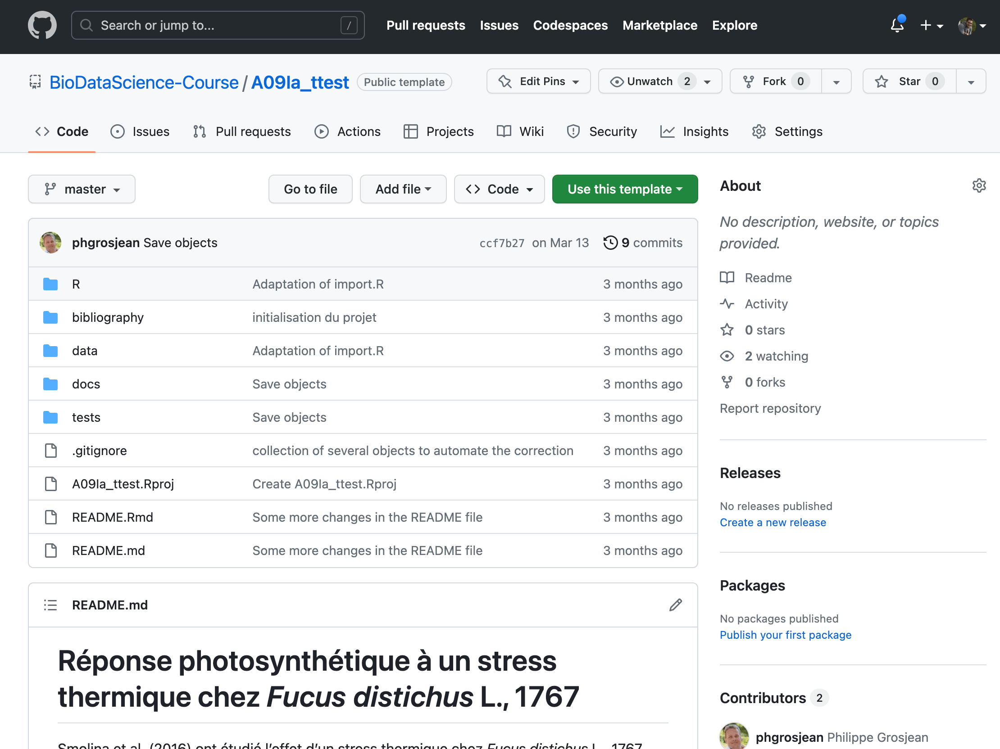{width="70%"}

### Projets GitHub Classroom cadrés (N3)

-   **Instructions** sous forme de commentaires

\vfill

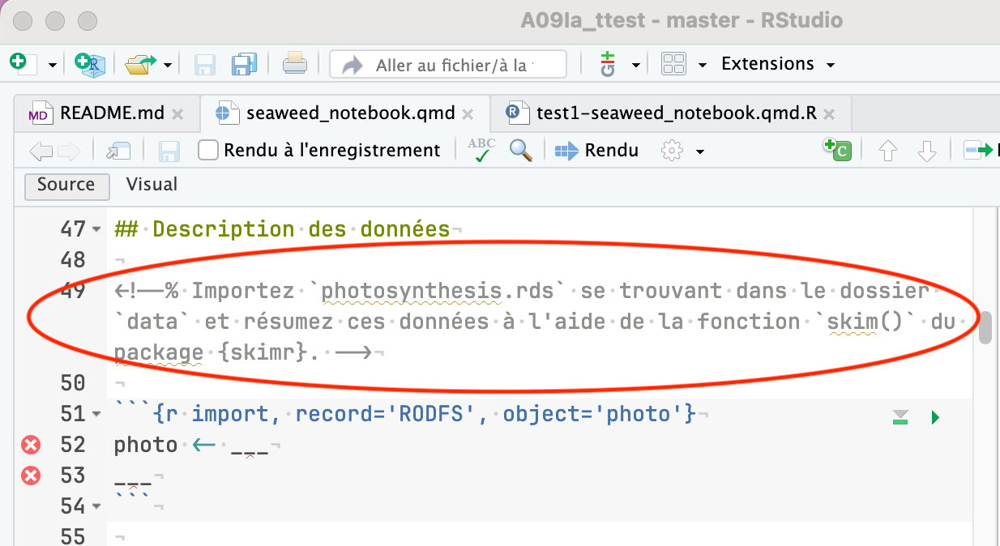{width="80%"}

\vfill

### Projets GitHub Classroom cadrés (N3)

-   Instructions sous forme de commentaires

-   Interprétation par **sélection des phrases correctes**

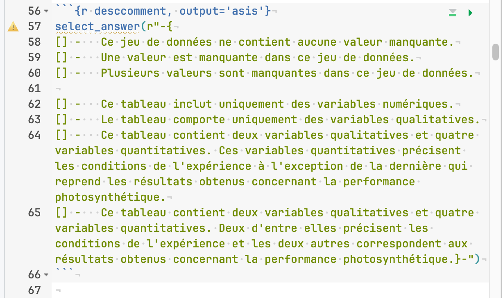{width="80%"}

### Projets GitHub Classroom cadrés (N3)

-   Instructions sous forme de commentaires

-   Interprétation par sélection des phrases correctes

-   **Évaluation semi-automatique** avec {testthat} + suggestions pour s'améliorer

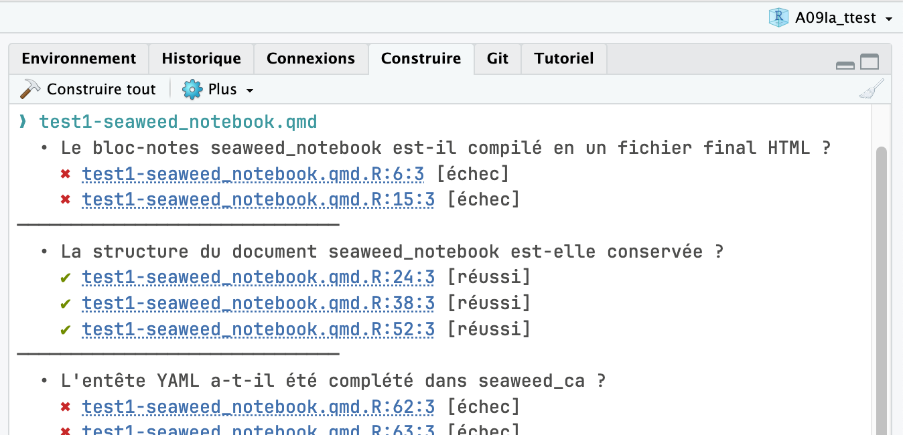{width="80%"}

### Correction des projets (grilles critériées)

100 étudiants \* 10 projets \* 30 critères = 30.000 évaluations !

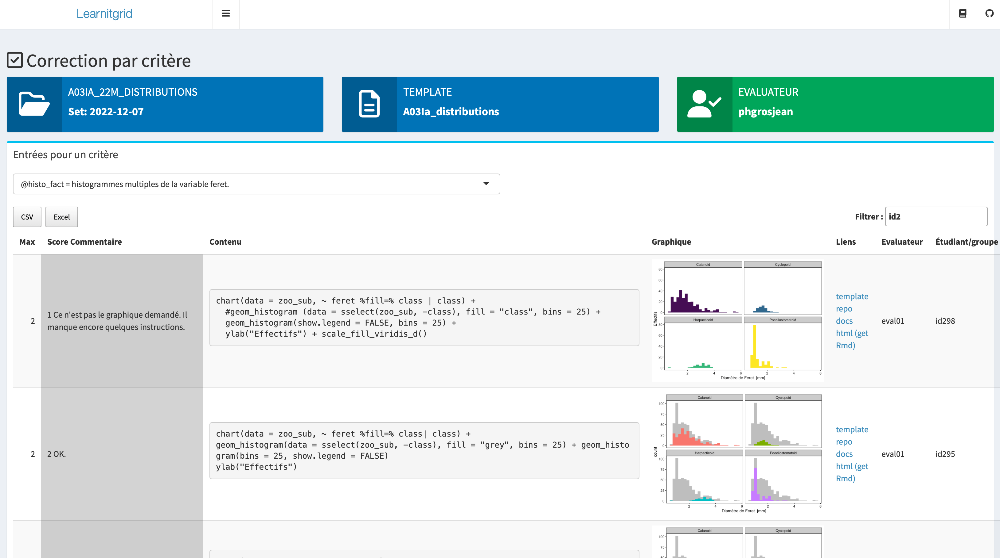{width="100%"}

## Support SAP

### Évaluation souhaitée en séance

-   **Première séance :** explication de l'approche pédagogique en Bab2, *16/9/2024 13h30 - 15h30, salle Vaughan (De Vinci)*

\vfill

-   **Module type :** SDD II, module 2 (assez difficile), *21/10/2024 10h30 - 12h30 + 24/10/2024 8h15 à 12h30, salle Vaughan (De Vinci)*

### Questions et difficultés (1/4 litteratie & Bloom)

-   Faible niveau en **littératie** de certains étudiants
    -   en **français** : incapables de comprendre et résumer une trentaine de pages de texte, habitués seulement à annoter des PowerPoints fournis par le prof
    -   en **mathématiques** : difficultés à comprendre des concepts de base, des équations simples...
    -   **numérique** : difficulté à utiliser un clavier, faire des actions simples (copier-coller, copie d'écran, recherche de mots dans un texte...)

*Comment leur faire prendre conscience et les aider ensuite ?* Pix ?

\vfill

-   Faible niveau par rapport à la **taxonomie de Bloom** (connaître et un peu comprendre) pour les autres cours

### Questions et difficultés (2/4 évaluation formative vs sommative)

-   Tous les exercices donnent des points (reconnaissance du travail), mais les N1-3 sont à visée formative

-   **Triche** possible (et facile en distanciel)

-   -\> Réussite avec un **niveau trop faible**

-   **Note absorbante** mal perçue

-   **Points négatifs** mal perçus + "fliquage"

-   **Inutilité constatée du redoublement** *(impossible de varier les exercices chaque année)*

### Questions et difficultés (3/4 perception)

-   **Réticence des étudiants** face à une autre pédagogie, incompréhension de l'inexistance d'un rattrapage en seconde session

-   **Mauvaise perception de l'évaluation continue par les collègues** : séances obligatoires et pas d'examen en seconde session

\vfill

-   **Examen en seconde session ou pas ?** Cf. évaluation continue. *Si pas pousse les étudiants à travailler pendant l'année, mais très mal perçu.*

### Questions et difficultés (4/4 temps et reconnaissance institutionnelle)

-   **Temps énorme à la préparation** (mais l'essentiel est écrit maintenant)

-   **Temps énorme à la correction** (learnitgrid nous aide bien + projet d'évaluation par les pairs)

-   **Temps énorme au coaching** individuel des étudiants (favoriser l'entre-aide dans la classe)

-   **Aide inefficace de la DSI** (serveur LRS, plateforme LearnIt::R, calcul sur le cloud...)

-   Souhait de passer à l'**évaluation avec Moodle + Safe Exam Browser** au lieu des interros papier

-   **Reconnaissance indispensable du travail réalisé**, *ainsi que du rôle pionnier en biologie, voire en Faculté des Sciences à l'UMONS*

------------------------------------------------------------------------

```{=tex}
\begin{center}
\textbf{Liens utiles}
\end{center}
```
\centering

{width="20%"}

\vfill

**Plateforme pédagogique LearnIt::R** : [\underline{\alert{https://github.com/learnitr}}](https://github.com/learnitr)

*en cours d'élaboration sur base du code développé pour nos cours*

\vfill

-   Site web du cours : [\alert{https://wp.sciviews.org/}](https://wp.sciviews.org/)

-   Organisation GitHub du cours : [\alert{https://github.com/BioDataScience-Course}](https://github.com/BioDataScience-Course)
