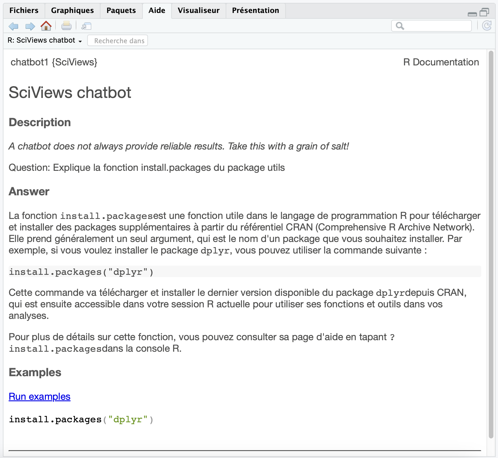

\begin{center}
\textbf{Résumé (max 300 mots)}
\end{center}

L'IA est déjà très présente dans R, notamment grâce à des package comme {ellmer}, {tidyllm} ou encore {rollama} qui proposent des connexions via API avec divers LLM (GPT-4o, Llama 3, Claude 3.5, Gemini 2.0...). Il existe également des packages qui facilitent l'interaction avec ces LLM et qui permettent d'accéder à des add-ins Shiny pour réviser et corriger du code, tels que {chores}, {gander} et {shinychat}. On peut aussi mentionner GitHub Copilot, pour lequel une intégration existe dans RStudio et Positron.

Dans R, une grande partie des pages d'aide est très technique pour une première approche d'une fonction. De plus, avec les fonctions génériques, il n'est pas toujours facile de trouver la page d'aide correspondante à la méthode utilisée. Cette complexité freine les nouveaux utilisateurs dans l'utilisation des pages d'aide. En outre, la barrière linguistique constitue un obstacle supplémentaire pour les utilisateurs non anglophones.

Dans ce contexte, nous proposons {helpai} qui permet, entre autres, de générer des pages d'aide simplifiées, éventuellement en français, grâce à l'IA choisie par l'utilisateur. Un addin Shiny permet de spécifier la fonction d'intérêt pour laquelle on souhaite une page d'aide simplifiée et la méthode, s'il s'agit d'une fonction générique. La page ainsi générée fournit une description non ou peu technique de la fonction en deux ou trois paragraphes, documente les principaux arguments et présente un exemple généralement exécutable. Enfin, cette page pointe vers la page d'aide "officielle" de ladite fonction suggérant, donc, à l'utilisateur de continuer à découvrir la fonction ciblée au travers de la documentation usuelle s'il le juge nécessaire.

\noindent \textbf{Mots-clefs (3 à 5)} : IA - Aide R - Enseignement - Shiny

## Développement

Les outils d'intelligence artificielle (IA) sont de plus en plus répandus et simples d'accès. De très nombreux grands modèles de langage (LLM) existent. On peut trouver des versions open source ou propriétaires, ainsi que des modèles généralistes ou spécialisés. Le modèle le plus connu est probablement GPT-4. De nombreux packages R comme {ellmer} [@ellmer], {tidyllm} [@tidyllm] et {rollama} [@rollama] ont été développés pour permettre d'interagir avec ces LLM via des API. D'autres packages tels que {gander} [@gander] et {chores} [@chores] s'appuient sur les premiers pour implémenter des addins Shiny qui permettent d'utiliser les LLM directement dans les scripts R, les documents Quarto ou R Markdown.

Les pages d’aide dans R sont rédigées par les développeurs de packages qui détaillent minutieusement leurs travaux et proposent souvent des explications techniques approfondies sur les fonctions. Cette documentation riche peut cependant être trop technique pour une première approche. Elle peut aussi rebuter potentiellement par un nombre important de sections, d'arguments et d'exemples fournis. Les pages d'aide des fonctions `library()` ou `install.packages()` sont des exemples caractéristiques. De plus, il est parfois difficile de trouver la bonne page d’aide lorsqu’on utilise des fonctions génériques comme `summary()` ou `plot()` car il faut rechercher la page relative à la méthode que R va sélectionner dans le code, ce qui rajoute une difficulté supplémentaire pour l'utilisateur de R débutant. Enfin, l’anglais constitue un obstacle supplémentaire pour certains utilisateurs non anglophones. Ces éléments poussent souvent les utilisateurs à chercher des informations sur les fonctions en dehors des pages d’aide, alors qu’il s'agit pourtant de l'outil dédié dans R.

Dans ce contexte, nous proposons le package [{helpai}](https://github.com/SciViews/helpai), qui permet notamment de générer des pages d’aide simplifiées et adaptées à la langue de l’utilisateur grâce à l’IA. La description est simplifiée, ne présentant que les arguments essentiels, ainsi qu'un exemple concret et généralement exécutable, est proposé. Cette page d’aide simplifiée se présente de manière similaire et s'affiche au même endroit que les pages HTML de R, par exemple, dans l’onglet "Help" de RStudio.

{width='70%'}

En pratique, l’utilisateur sélectionne la fonction qui l’intéresse dans un script R, un document Quarto ou R Markdown et lance l’addin dédié dans RStudio. Il peut aussi accéder à cette fonctionnalité par une instruction R (dans un terminal, ou un autre IDE). Si la fonction est générique, l’ensemble des méthodes disponibles est présenté dans une liste de choix. Cette première étape permet de sélectionner la bonne fonction puis de générer la page d’aide simplifiée relative au contexte correct.

Ce package est actuellement en cours de test avec une bonne centaine d'étudiants qui suivent des cours de sciences de données biologiques à l’Université de Mons, en Belgique. Le modèle Open Source codestral-22B, spécialisé pour les tâches associées à la programmation et développé par la société Mistral, est employé sur des serveurs dédiés et connectés au package [{helpai}](https://github.com/SciViews/helpai).

## Références
