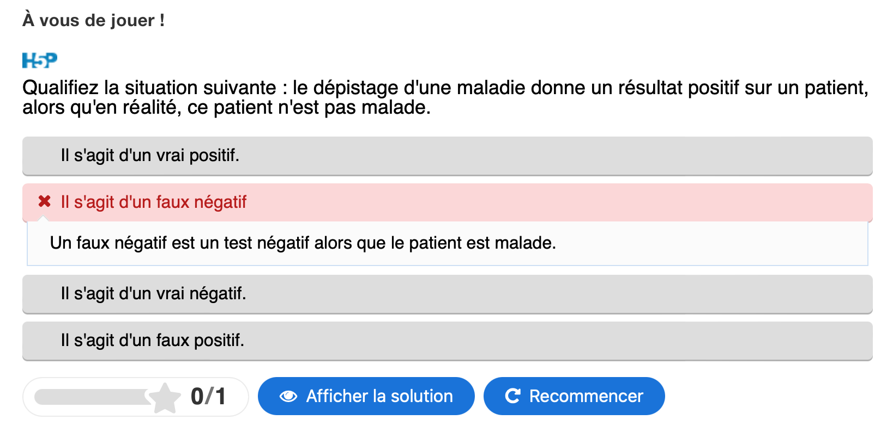
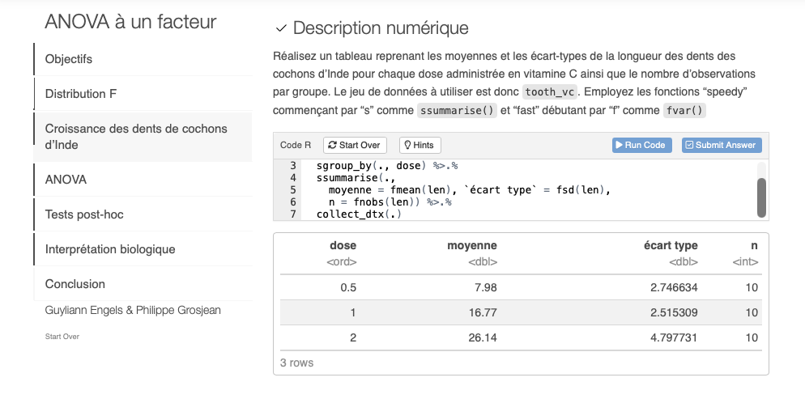
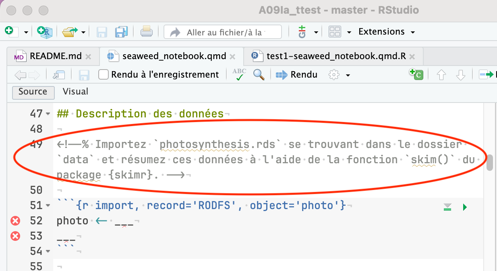
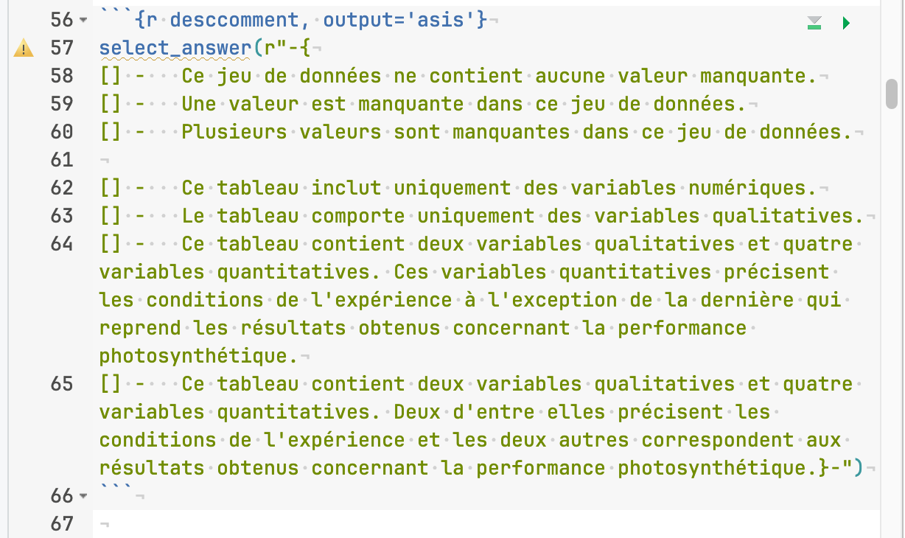
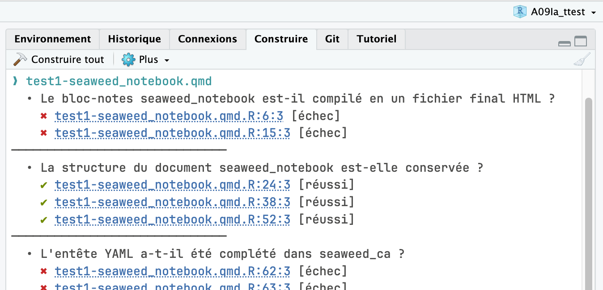
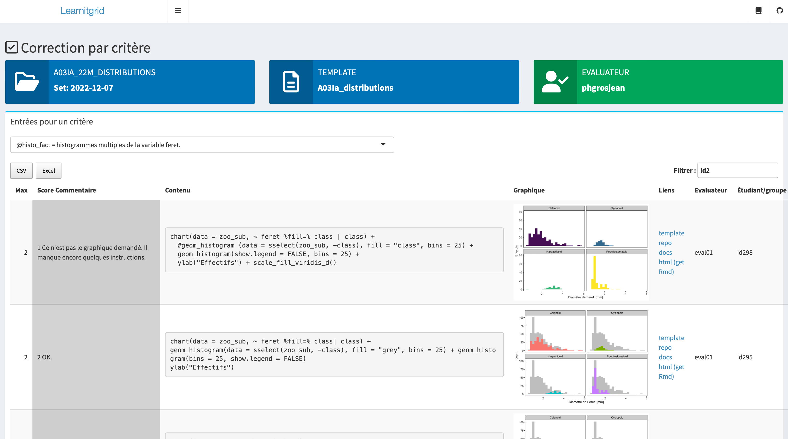
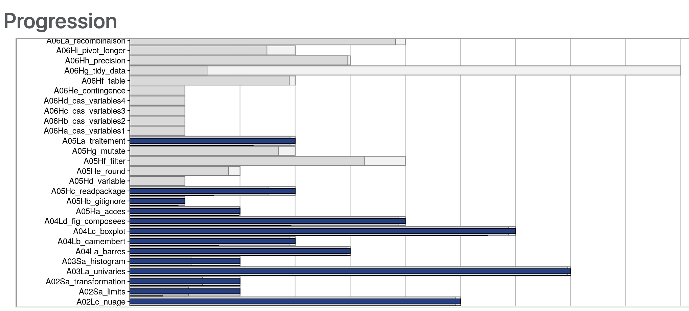
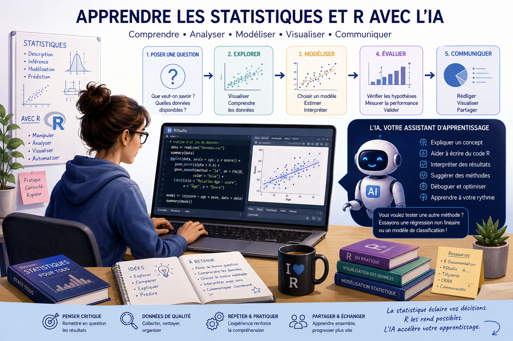
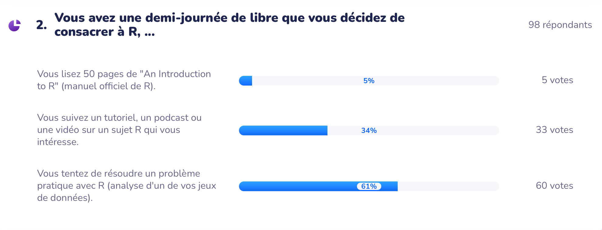

```{r setup, include=FALSE}
knitr::opts_chunk$set(echo = FALSE, warning = FALSE, message = FALSE)
```

### Ordre du jour

- Tour de table : résumé des approches péda/andragogiques ULB et UMONS, aspects que chacun•e souhaite mettre en avant,

- E-learning et matériel pédagogique en classe inversée - écosystème logiciel utilisé, solutions pratiques

- Engagement des apprenant - différence ULB / UMONS - progression par niveaux, gamification…

- Suivi des activités - learning analytics, reporting

- Encadrement de l’IA côté apprenant, utilisation de l’IA côté formateurs (évaluation semi-automatisée entre autres)

- Adaptation d’un même contenu à différent publics (universitaire, formation continuée)

### Tour de table

- Approche andragogique à l'ULB

...

### Tour de table

- Approche pédagogique à l'UMONS : progression selon la taxonomie de Bloom

{width="70%"}

### Tour de table

- Approche pédagogique à l'UMONS : Progressivité en 4 niveaux, d'abord le code R principalement (niveau 2), puis les interprétations stats (niveaux 3 et 4)

{width="100%"}

### Tour de table

Questions directement dans le cours en ligne en niveau 1 (autoapprentissage)

{width="100%"}

### Tour de table

Focalisation sur le code R principalement en tutoriel niveau 2 (learnr)

{width="100%"}

### Tour de table

Instructions dans le document R Markdown/Quarto (projets dirigés en niveau 3)

{width="80%"}

### Tour de table

Initiation à l'interprétation statistique (sélection de phrases dans une liste en niveau 3)

{width="80%"}

### Tour de table

Batterie de tests en niveau 3 permettant l'auto-vérification et auto-correction des réponses (un clic sur un élément erroné mène à des suggestions pour le corriger)

{width="80%"}

### Tour de table

- Approche pédagogique à l'UMONS : contextualisation, décontextualisation, recontextualisation

{width="100%"}

### Tour de table

- Démonstration de quelques outils "maison"

\centering

{width="80%"}


### E-learning et matériel pédagogique en classe inversée

- Aspects pratiques : logiciels utilisés, fonctionnalités utiles

- Points importants dans la scénarisation

- Points importants dans le contenu

\vfill

{width="50%"}

### Engagement des apprenant

- Différences ULB / UMONS

- Progression par niveaux

- Gamification …

{width="60%"}

### Suivi des activités

- Learning analytics

- Reporting

\vfill

{width="80%"}

### Apprentissage et IA

- Encadrement de l’IA côté apprenant

- Utilisation de l’IA côté formateurs (évaluation semi-automatisée entre autres)

\vfill

{width="80%"}

### Adaptation d’un même contenu à différent publics

- Étudiant dans un contexte universitaire (Bachelier / Master)

- Professionnels en formation continuée menant à une microcertification

\vfill

{width="100%"}

### Conclusions

- ...

- ...

```{=tex}
\begin{center}
\textbf{Liens utiles}
\end{center}
```
\centering

- Site ULB HelSci : [\alert{https://www.ulb.helsci.be}](https://www.ulb.helsci.be)

- Module logiciel R à HelSci : [\alert{https://www.ulb.helsci.be/module-initiation-et-pratiques-avancees-du-logiciel-r-pour-les-donnees-de-sante/}](https://www.ulb.helsci.be/module-initiation-et-pratiques-avancees-du-logiciel-r-pour-les-donnees-de-sante/)

- Site web du cours à l'UMONS : [\alert{https://wp.sciviews.org/}](https://wp.sciviews.org/)

- Organisation GitHub du cours à l'UMONS : [\alert{https://github.com/BioDataScience-Course}](https://github.com/BioDataScience-Course)

- Plateforme pédagogique LearnIt::R : [\alert{https://github.com/learnitr}](https://github.com/learnitr)

*en cours d'élaboration sur base du code développé pour nos cours*
