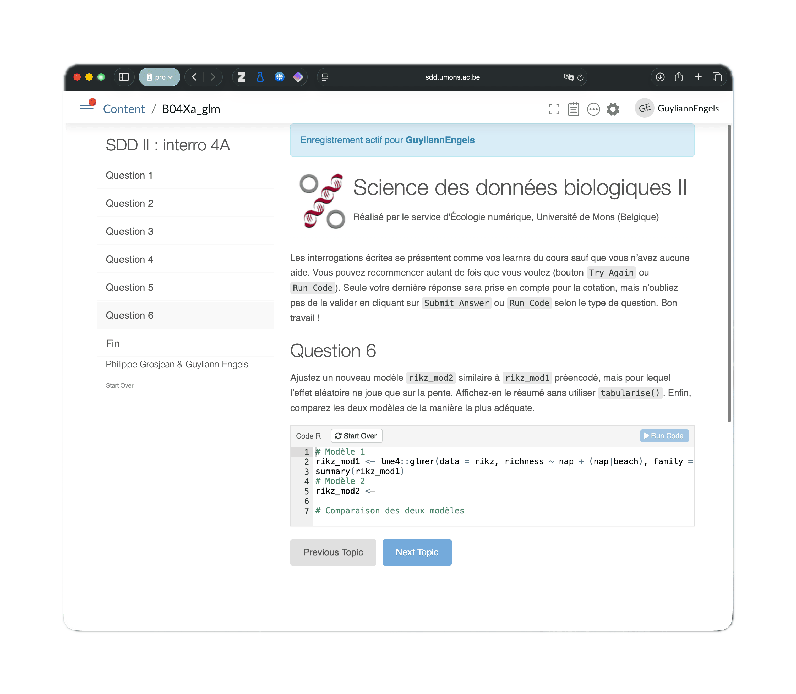
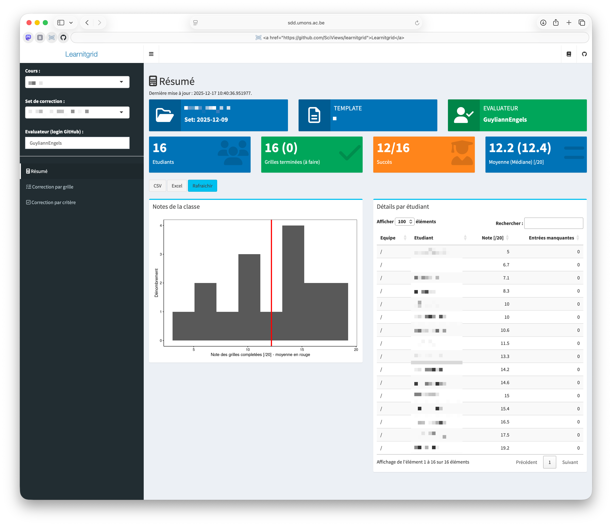
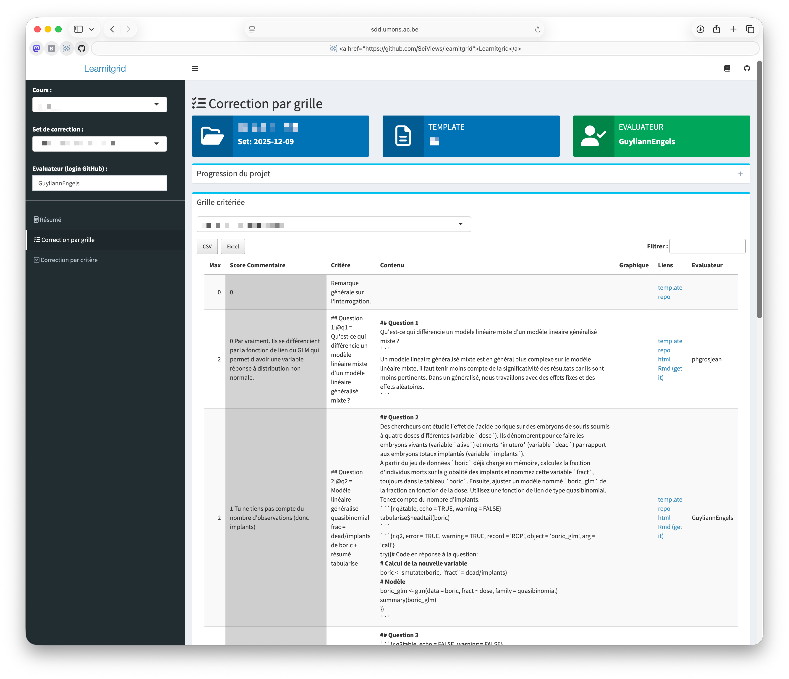
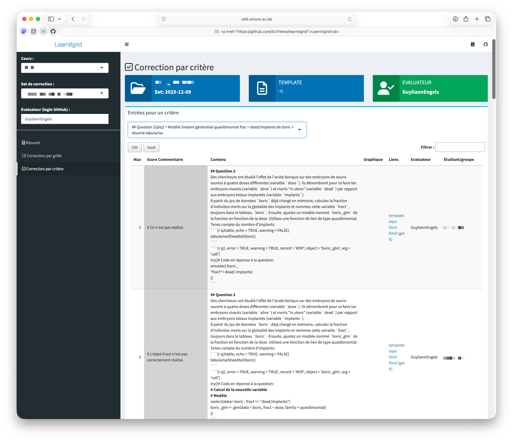
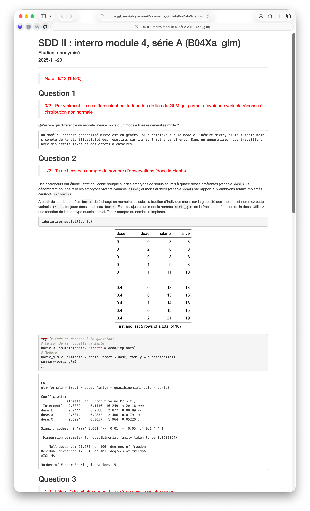

## Example of an exam using a learnr

This is an example exam (in French) with interactive R coding. It is an [R Markdown file](exam_example.Rmd) that has special tags to both use it as a **[{leanr}](https://rstudio.github.io/learnr/) application** during the exam itself, and to turn it into a **corrected version** in HTML format with the answers of a student and the mark and comments from the teacher.

### The learnr

Here is how it looks like during the exam in learnr format:

Here is a question where the student can elaborate its answer through R code and test it in R directly as much as he wants before submitting its final output:

And here is the last page with a link to exit the exam:

This learnr document is published in a [POSIT Connect server](https://posit.co/products/enterprise/connect/) that is deployed for a course. Note: POSIT offers free academic licenses for POSIT Connect for courses that teach R and Tidyverse and use RStudio (see https://posit.co/pricing/academic/). In order to secure the R process on the server, **[AppArmor](https://documentation.ubuntu.com/server/how-to/security/apparmor/)** is used. Here is the [AppArmor config file](AppArmor_r-learnr.txt) we use. One can also restrict the resources that the student can access on the machine by using **[Safe Exam Browser](https://safeexambrowser.org/start/start_en.html)**. It is possible to lock the computer in kiosk mode where only the learnr pages of the exam can be displayed. One can also open access to other, selected pages (e.g. the inline course), or to selected applications.

Students' answers are recorded in a MongoDB database thanks to the extensions provided by [{learnitdown}](https://learnitr.r-universe.dev/learnitdown), and configured for the course using dedicated R packages that provide the login and password to the MongoDB database in a crypted way. For the example, it is the [{BioDataScience}](https://github.com/BioDataScience-Course/BioDataScience) and [{BioDataScience2}](https://github.com/BioDataScience-Course/BioDataScience2) packages (note that there are also a lot of learnrs for training in the `inst/tutorials` subdirectories of the last one).

The students access the exam by using the Safe Exam Browser config file (a .seb file) that configures their web browser for the session.

### Correction of the exam and feedback to students

Once the exam is done, the learnr is locked on the server, and the correction is made with [{learnitgrid}](https://learnitr.r-universe.dev/learnitgrid), a Shiny application that is also running on the POSIT Connect server:

The answers to all the questions can be corrected student by student ("Correction par grille" at left):

They can also be corrected question by question for all students ("Correction par critère" at left), with a sorting of the answers by similarities. This view is better to mark the answers in a balanced way, and to spot suspect items (cheating):

A dedicated R script extracts answers to this exam and prepares data for {learnitgrid}.

When corrections are done, a final, corrected document as a standalone HTML file, is compiled for each student using another R script. It merges the questions, the answers done by one student, and the marks and comments of the teacher in red (this is done in a loop for all students, of course). This document is distributed to the students, in our case, through their progress report using [{learnitprogress}](https://learnitr.r-universe.dev/learnitprogress). Of course, any other means to distribute these files can also be used (email, post in a learning management system like Moodle...). An [example of (anonymized) corrected file can be seen here](exam_example_corrected.html).

### Are you interested?

If you are interested by this approach, please, send us an email at <sdd@sciviews.org>. The R scripts to prepare the correction and to generate the corrected version are currently specific to our course. If there is enough interest, we may rework them and create a package that could be reused in other courses, together with more elaborated documentation.
