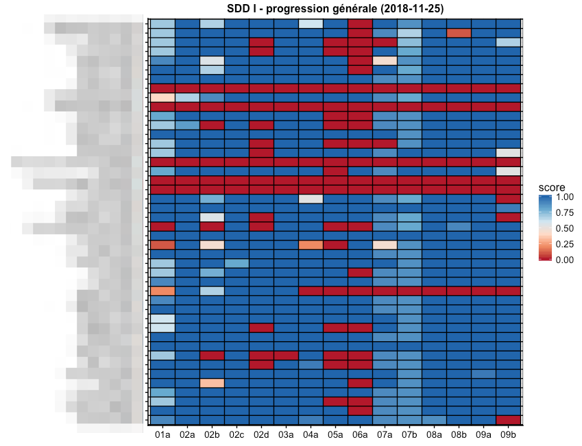

# Présentations relatives au projet SDD à l'UMONS

Ce dépôt centralise l’ensemble des présentations, des posters et des outils de démonstration employés pour présenter la méthode d’enseignement de nos cours de Science des Données Biologiques à l'Université de Mons.

Depuis la rentrée académique 2017-2018, un processus de réflexion est lancé afin de renouveler l’enseignement de la biostatistique au sein du cursus de biologie. Avec la masse de données en croissance exponentielle, nécessitant des outils spécialisés pour les aborder, la crise de la reproductibilité́ en science, l’Open Science, l’Open Data, l’Open Knowledge (Directives européennes), les besoins des étudiants ont évolués.

Les noms des cours sont changés en Sciences des Données Biologiques. Le changement du nom de ces cours va de pair avec une remise en question profonde des notions indispensables à enseigner aux biologistes en matière de science des données ainsi que sur la méthode d’enseignement. Les notions importantes ont été précisément définie et répartie entre les cours de science des données I à V (dont les cours I, II et III sont des cours obligatoires).

Le premier cours de sciences des données biologiques I a été élaboré et dispensé lors de l'année académique 2018-2019. Des données sur l'utilisation du matériel pédagogique par les étudiants sont collectées depuis ce moment afin de permettre une analyse de l'apprentissage par les étudiants dans le but de l'améliorer encore. Prenons comme exemple, la participation aux exercices de type "learnrs". Un très haut taux de participation des étudiants est observé à ces séances d'exercices. Ceci indique donc une forte implication dans l'apprentissage de la matière par la quasi-totalité de la classe.

Le nom des étudiants en ordonnée est flouté. Les différentes séances d'exercices sont en abscisse. Les scores indiquent le taux de réponses aux questions de ces learnrs.

## Présentations

- `2018_rennes`, poster : **Introduction de nouveaux outils (learnr, Github classroom, ...) dans les cours de Science des Données Biologiques à l'UMONS**

Lors de la septième édition des rencontres R à Rennes sur le site de l'Agrocampus Ouest du 4 au 6 juillet 2018, nous avons présenté le poster s'intitulant : "Introduction de nouveaux outils (learnr, Github classroom, . . . ) dans les cours de Science des Données en Biologie".

- `2018_vice_recteur`, présentation : **Science des Données Biologiques : Rendons les étudiants actifs de leurs apprentissages**

Lors d'une réunion avec le vice-recteur à l'enseignement de l'Université de Mons (Prof. Marc Demeuse), nous avons réalisé une présentation intitulée : "Science des données biologiques : Rendons les étudiants actifs de leurs apprentissages".

- `2019_JDE`, évènement : **Rendons les étudiants acteurs de leur propre apprentissage de la Science des Données Biologiques**

Lors de la journée des enseignants de l'UMONS du 15 mars 2019, nous avons organisé un stand (combinaison d'un poster, d'une présentation et d'outils) afin de présenter notre philosophie d'apprentissage de la Science des Données Biologiques. Nous avons intitulé ce stand "Rendons les étudiants acteurs de leur propre apprentissage de la Science des Données Biologiques".

- `2019_user_toulouse`, poster : **Better learning of data science in a biology curriculum by using R, RStudio, learnr & GitHub Classroom**

Le colloque UseR!2019 qui regroupe les utilisateur mondiaux de R s'est déroulé les 9-12 juillet 2019 à Toulouse. Nous y avons présenté un poster présentant notre méthode d'enseignement de la Science des Données Biologiques à l'UMONS.

- `2021_user_zurich`, note technique : **Teaching Biology students to code smoothly with learnr and gradethis**. La lightning talk sur **An Integrated Teaching Environment for R with {learnitdown}** est disponible ici: https://filedn.com/lzGVgfOGxb6mHFQcRn9ueUb/sdd_presentations/UseR_Grosjean_Engels.mp4

Le colloque User!2021, organisé par l'Université de Zürich en distanciel les 5 à 9 juillet 2021 fût l'occasion de brièvement préseter les avancées dans nos cours de Science des Données Biologiques. La note technique se focumalise sur l'utilisation de {learnr} et {gradethis}, tandis que l'"elevator pitch" de 5 minutes introduit la plateforme pédadogique que nous avons mis au point pour ces cours. Elle est centrée autour du package R {learnitdown}.

- `2021_rencontresr_paris`, présentations : **Retour d'expérience sur l'enseignement de la science des données biologiques en classe inversée**. La vidéo démo associée est disponible ici: https://filedn.com/lzGVgfOGxb6mHFQcRn9ueUb/sdd_presentations/rr2021_engels_demo.mp4. **Perception de R et RStudio par des apprenants dans des cours de science des données biologiques**.

Les Rencontres R 2021 à Paris nous ont permis de présenter plus en détails nos cours de Science des Données Biologiques sous forme de deux exposées successifs de 25 min chacun. Le premier exposé détaille le matériel pédagogique (h5p, learnr, projects GitHub, bookdown intégré dans un site Wordpress avec identification via son compte GitHub et Moodle), ainsi que quelques données sur les exercices. La seconde présentation se focalise sur l'apprentissage et l'approche en 4 niveaux d'exercices de difficulté croissante élaborés pour ces cours pour assurer l'assimilation des concepts par la très grosse majorité (>90%) de nos étudiants. Leur perception générale, ainsi que la charge cognitive et l'utilisabilité des outils est également discutée.
