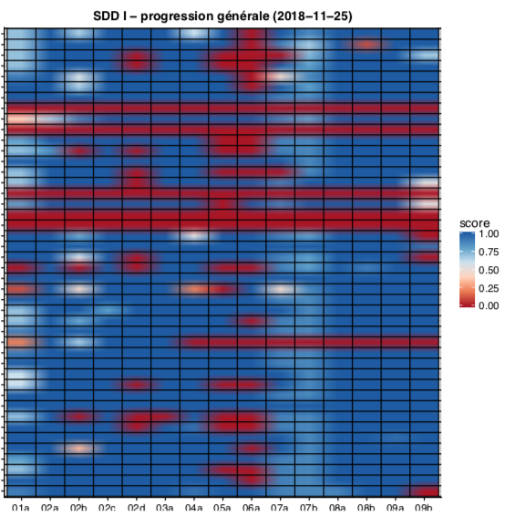

```{r setup, include=FALSE}
knitr::opts_chunk$set(echo = TRUE)
SciViews::R
```


### Présentation 

Les statistiques “classiques” telles qu’enseignées dans un cursus de biologie sont de plus en plus insuffisantes dans le contexte actuel de la recherche.

 **Crise de la reproductibilité**, **Open Science**, **Open Data**, **Open Knowledge**

\hfill

Notre solution :

- Suppression des cours et de tp 
- Etudiants actifs
- Apprentissage en continu

Nos espérences :

- Travaux reproductible : <https://github.com/BioDataScience-Course/sdd4_memoir>

### Processus d’apprentissage continu

L'apprentissage est réparti sur 4 années pour un total de 16 crédits (175h en présentiel)


### Processus d'apprentissage actif

Contenu des cours centralisé, varié, en ligne et en constante amélioration :  <http://biodatascience-course.sciviews.org>


### En pratique 

Prenons le module 2 du cours de science des données I : visualisation et inférence (<http://biodatascience-course.sciviews.org/sdd-umons/visu1.html>)

\hfill

\hfill


\columnsbegin
\columnhalf

**Etudiant**

\hfill

- Théorie sous diverse forme

- Exercice individuelle

- Projet par équipe

\columnhalf

**Professeur**

\hfill

- [leanrR](https://rstudio.github.io/learnr/)

- [GitHub Classroom](https://classroom.github.com)

- [GitHub](https://github.com)

\columnsend

___

Progression des étudiants via les quiz en ligne 

\columnsbegin
\columnlarge



\columnsmall

**Progression des étudiants**

\hfill

Lors de la réalisation des exercices, toutes les données sont récupérées et stockées sur une base de données.

- Progression générale

- Progression individuelle

\columnsend

### Pour aller plus loin

Prenons le module 2 du cours de science des données I : visualisation et inférence (<http://phgrosjean.sciviews.org/bookdown-test/visu1.html>)

- [shiny app](https://shiny.rstudio.com)

- [H5p](https://h5p.com)

### Présentation

Présentation d'un poster à la conférence : Rencontres R à Rennes 2018

[Introduction de nouveaux outils (learnr, Github classroom,. . . ) dans un cours de Science des Données Biologiques](https://github.com/BioDataScience-Course/RencontresRRennes2018)

\hfill

\alert{Grand intérêt marqué par les professeurs présents}
